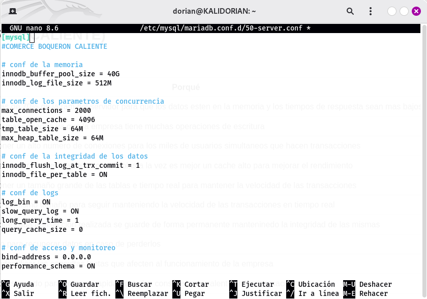
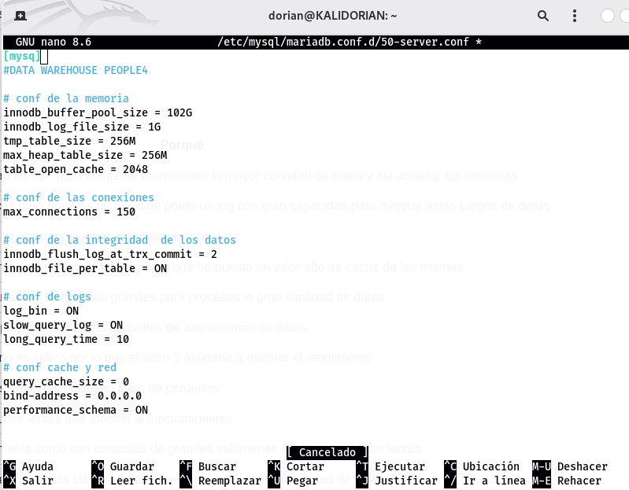
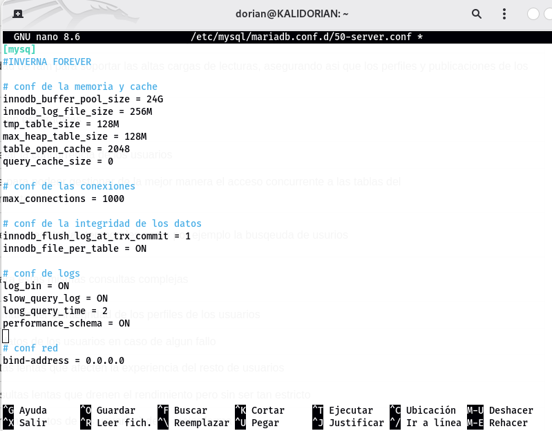

# **DBA**

## **EMPRESA 1 (COMERCE BOQUERÓN CALIENTE)**

🎤 [**ENTREVISTA**](entrevistas/entrevista01.mp3)

| Parámetro| Valor | Porqué |
|---|---|---|
|innodb_buffer_pool_size|40 GB| le asignaria mas de 70% de la ram del servidor para que  los datos esten en la memoria y los tiempos de respuesta sean mas bajos |
|innodb_log_file_size| 512 M | le pondria un tamaño grande ya que la empresa tiene muchas operaciones de escritura |
|max_connections| 2000 | he decidido poner un alto numero de conexiones para los miles de usuarios simultaneos que hacen transacciones|
|table_open_cache| 4096 | como miles de usuarios accederan a muchas tablas a la vez es mejor un cache alto para mejorar el rendimiento |
|tmp_table_size| 64 M| he decidido poner un tamaño grande de las tablas e tiempo real para mantener la velocidad de las transacciones|
|max_heap_table_size| 64 M | aqui he puesto el mismo tamaño para seguir manteniendo la velocidad de las transacciones en tiempo real  |
|innodb_flush_log_at_trx_commit| 1 | esto asegura que cada transaccion realizada se guarde de forma permanente manteninedo la integridad de las mismas |
|log_bin| ON | esto encendido para recuperar datos en caso de perderlos |
|slow_query_log| ON | activado para identificar las consultas lentas que afecten al funcionamiento de la empresa |
|long_query_time| 1 | he establecido 1 segundo para detectar rapidamente las consultas que ralentizen las transacciones |
|innodb_file_per_table| ON | esto encendido para una mejro gestión y recuperación de los datos |

## **EMPRESA 2 (DATA WAREHOUSE PEOPLE4)**

🎤 [**ENTREVISTA**](entrevistas/entrevista02.mp3)

| Parámetro| Valor | Porqué |
|---|---|---|
|innodb_buffer_pool_size| 102 GB| Le he asignado una alta capacidad de ram para mantener en memoria la mayor cantidad de datos y asi acelerar las consultas |
|innodb_log_file_size| 1 GB | ya que las escrituras son periodicas pero grandes he decidido poner un log con gran capacidad para mejorar estas cargas de datos |
|max_connections| 150 | el numero es bajo ya que no hay muchas conexiones simultaneas|
|table_open_cache| 2048 | las consultas suelen acceder a un gran numero de tablas por lo que he puesto un valor alto de cache de las mismas |
|tmp_table_size| 256 M| algunas consultas requieren crear tablas temporales grandes para procesas la gran cantidad de datos |
|max_heap_table_size| 256 M | aqui he puesto el mismo tamaño para estas mismas consultas de alto volumen de datos |
|innodb_flush_log_at_trx_commit| 2 | como la integridad transaccional no es critica por lo que el valro 2 ayudaría a mejorar el rendimiento|
|log_bin| ON | esto encendido para recuperar los datos históricos en caso de perderlos |
|slow_query_log| ON | activado para identificar las consultas lentas que afecten al funcionamiento |
|long_query_time| 10 | he establecido 10 ya que normalmente como son consultas de grandes volumenes de datos pues son lentas |
|innodb_file_per_table| ON | esto encendido para una mejro gestión de las tablas que pueden llegar a tener gran cantidad de datos |

## **EMPRESA 3 (INVERNA FOREVER)**

🎤 [**ENTREVISTA**](entrevistas/entrevista03.mp3)

| Parámetro| Valor | Porqué |
|---|---|---|
|innodb_buffer_pool_size| 24 GB| Le he asignado una buena capacidad de ram para soportar las altas cargas de lecturas, asegurando asi que los perfiles y publicaciones de los usuarios se carguen rápidamente |
|innodb_log_file_size| 256 M | un poco bajo ya que las escrituras son esporádicas |
|max_connections| 1000 | un numero considerable para manejar la concurrencia de los usuarios|
|table_open_cache| 2048 | he decidido esta cantidad de cache para podeer gestionar de la mejor manera el acceso concurrente a las tablas del sistema(usuarios,publicaciones,comentarios,etc) |
|tmp_table_size| 128 M| algunas consultas complejas requieren crear tablas temporales como por ejemplo la busqeuda de usurios |
|max_heap_table_size| 128 M | aqui he puesto el mismo tamaño para estas mismas consultas complejas|
|innodb_flush_log_at_trx_commit| 1 | el valor está establecido en 1 para mantener la integridad de los perfiles de los usuarios|
|log_bin| ON | esto encendido para recuperar los datos de los usuarios en caso de algun fallo |
|slow_query_log| ON | activado para identificar las consultas lentas que afecten la experiencia del resto de usuarios |
|long_query_time| 2 | he establecido 2 para detectar consultas lentas que drenen el rendimiento pero sin ser tan estricto |
|innodb_file_per_table| ON | para poder gestionar el almacenamiento( datos de los usuarios) de la mejor forma |

## **CONFIGURACIÓN DE LOS PARÁMETROS EN TERMINAL**

### Direccion del archivo de configuración

### Configuración Empresa 1

### Configuración Empresa 2

### Configuración Empresa 3

### Reinciar servicio para cada configuración

