# **USERS MYSQL**
___
## **CREACIÓN DE TABLAS INICIALES**

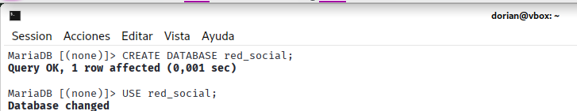
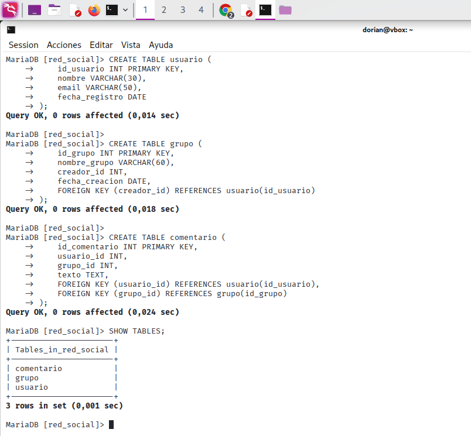

___
## **PANTALLAZOS DE LAS SENTENCIAS**

#### 1- Indica el nombre de las tablas de tu mysql
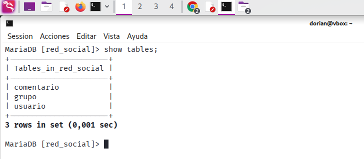

#### 2- Crea el usuario "Bego" con contraseña "Beglña" para que pueda acceder desde localhost.

#### 3- Crea el usuario "Mati" con contraseña "aMti90" para que pueda acceder desde el dominio lasalleinstitucion.es .
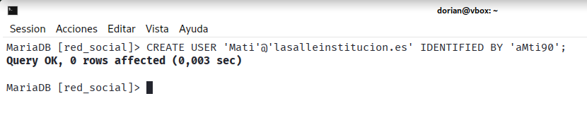

#### 4- Crea el usuario "Mifli" con contraseña "lopol45" para que pueda acceder desde el dominio lasalleinstitucion.es.
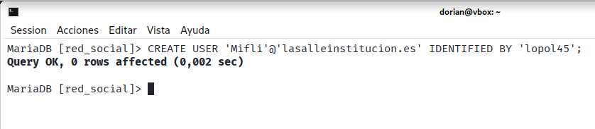

#### 5- Muestra los usuarios creados (los que están en la tabla user de la base de datos mysql).
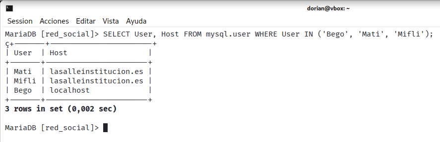

#### 6- Muestra el usuario con el que te has logado, utilizando para ello una función.
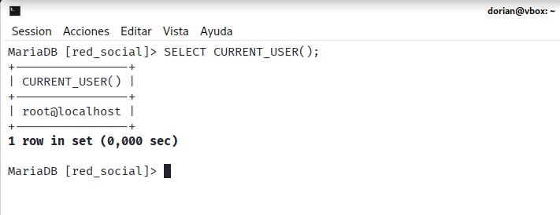

#### 7- Cambia la contraseña de Mati, de manera que la nueva contraseña sea "minuevacontraseña”. 
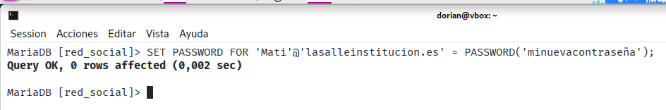

#### 8-Muestra los privilegios del usuario Bego. 
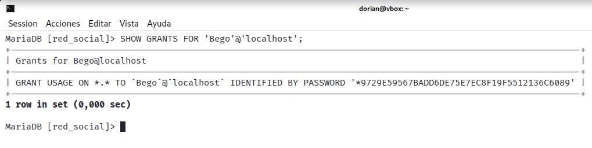

#### 9- Muestra los privilegios del usuario con el que te has logado.
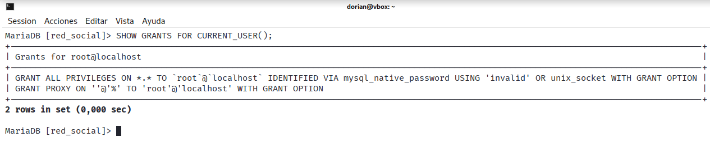

#### 10- Concede permisos al usuario Bego de lectura y actualización sobre la tabla usuario. 
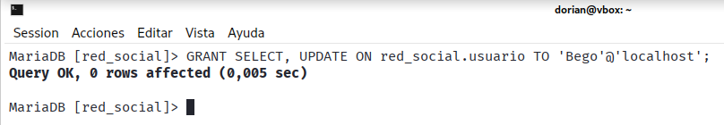

#### 11- Conéctate como Bego y lanza una sentencia select y otra update sobre la tabla usuario. Lanza también una sentencia delete. Muestra las sentencias y sus efectos sobre la base de datos de la red social.

#### 12- Concede permisos al usuario Mati de borrado sobre la tabla grupo.
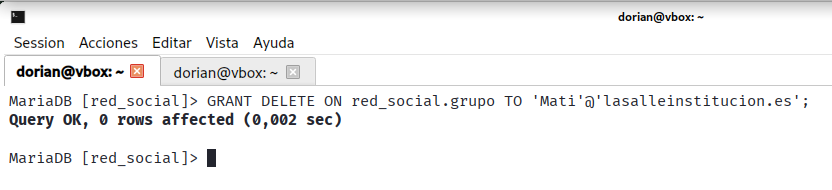

#### 13- Crea el usuario Crispula con contraseña “rosita” para que pueda acceder desde el dominio lasalleinstitucion.es y con permiso de lectura, actualización y borrado sobre las tablas usuario, grupo y comentario. Concede además permisos a Crispula para que pueda conceder sus permisos a otros usuarios
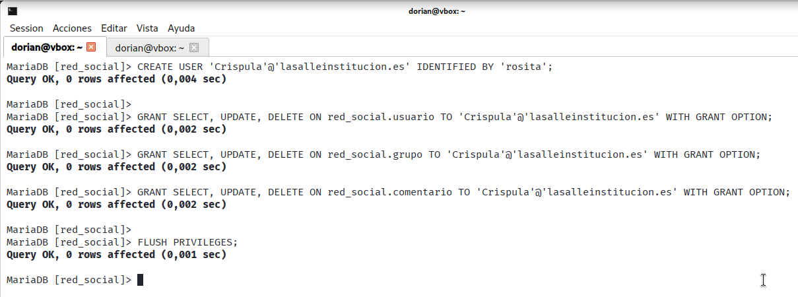

#### 14- Conéctate con el usuario Crispula
En este caso no me conecta con el usuario de Crispula ya que no logra conectar con el dominio de la salle y validar dicho usuario
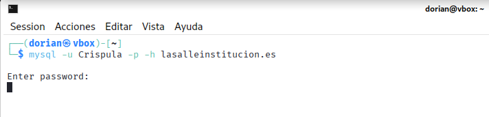

#### 15- Inserta un registro en la tabla comentario. Actualiza un registro de la tabla grupo. Muestra las sentencias y su resultado al ejecutarlas sobre la base de datos de la red social.
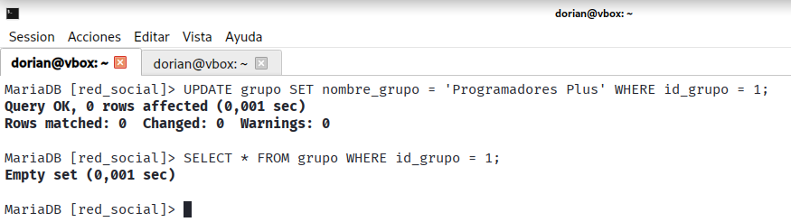

#### 16- Concede permiso de borrado sobre la tabla usuario a Bego. 
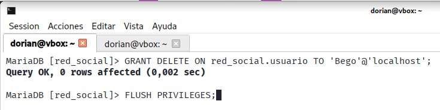

#### 17- Concede permiso de lectura y actualización sobre la tabla grupo a Mati.
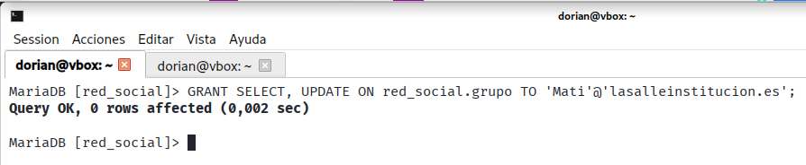

#### 18- Vuelve a conectarte con tu usuario de mysql.
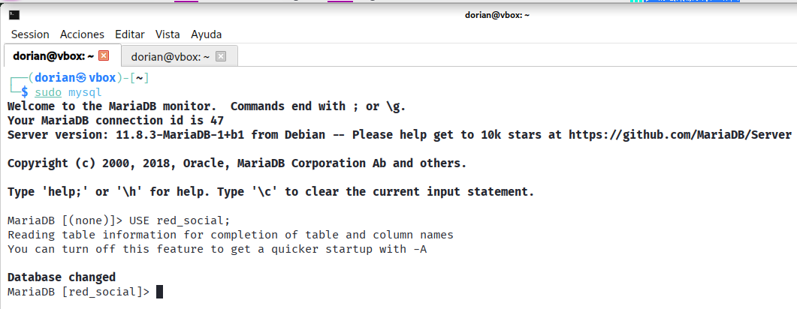

#### 19- Concede permisos totales sobre todas las tablas de la base de datos de la red social a Mifli.
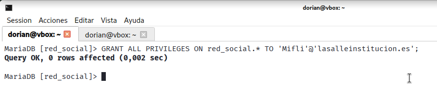

#### 20- Quítale permisos de borrado sobre todas las tablas de la base de datos de la red social Mifli. 
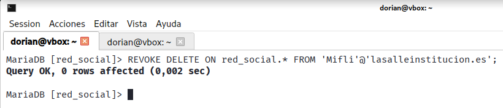

#### 21-  Muestra los usuarios creados y sus privilegios (los que están en la tabla user de la base de datos mysql). 
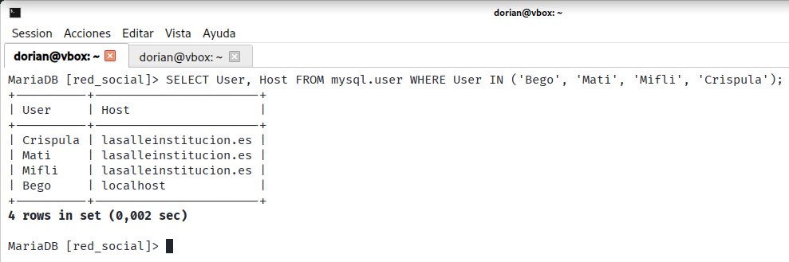

#### 22- Cambia la contraseña del usuario Mifli modificando directamente la tabla user.
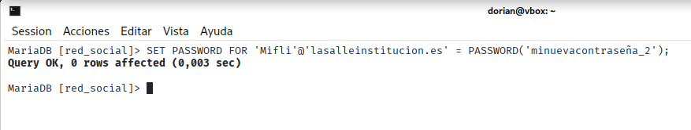

#### 23- ¿Has necesita hacer FLUSH PRIVILEGES después de la sentencia anterior? Explica el porqué y para qué sirve FLUSH PRIVILEGES.

Si, ya que la nueva contraseña de Mifli se guarda en el disco de mysql, sin embargo la anterior contraseña sigue en la caché que es la que usa mysql normalmente, por lo que es necesario reiniciar esta caché con FLUSH PRIVILEGES.
    FLUSH PIRVILEGES fuerza al servidor de mysql a recargar la información de permisos de la tablas 
de concesiones como mysql.user que están en el disco de la memoria, esto permite realizar los cambios sin tener que reiniciar el servicio.

#### 24- ¿Puedo utilizar la función PASSWORD con GRANT? Justifica tu respuesta.

 En versiones antiguas de mysql si es necesario usar la función PASSWORD dentro de la sentencia GRANT si se intenta establecer una contraseña mediante la cláusula IDENTIFIED BY en el mismo comando, ya que esta versión de mysql no cifra la contraseña en texto plano. Sin embargo, en versiones mas recientes de mysql como la que tenemos no hace falta usar la función PASSWORD ya que mysql ya cifra la contraseña sin tener que recurrir a esta función.

#### 25- Elimina el usuario Mifli. 
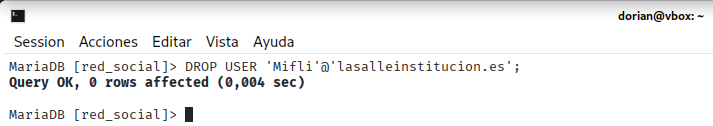
