# REDIS CHALLENGE 
___

## Parte 1: Instalación de Redis

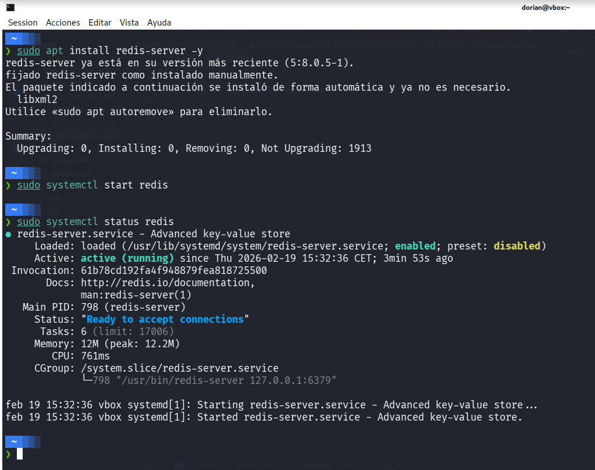

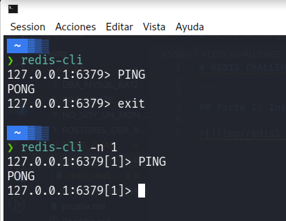

___

## Parte 2: Comandos básicos en Redis

* ### Comandos básicos para claves

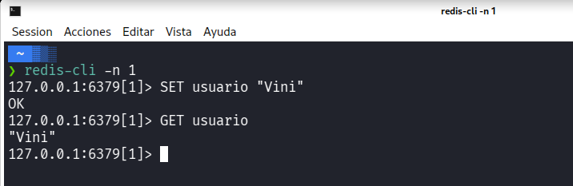
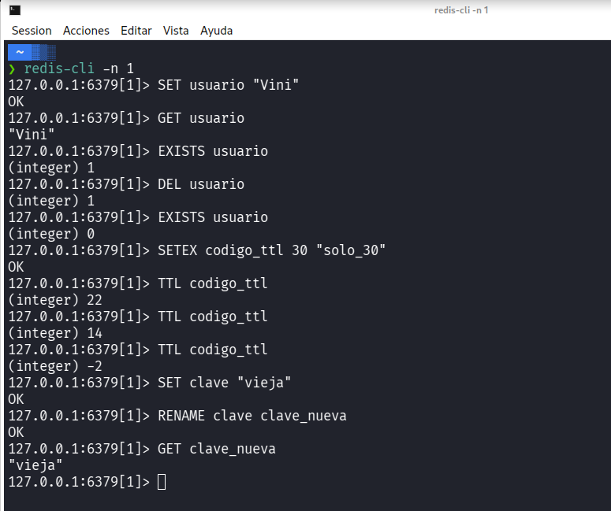

* ### Listas

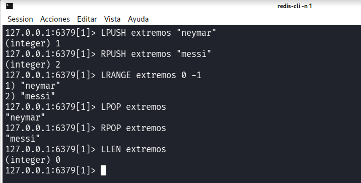

* ### Conjuntos (Sets)

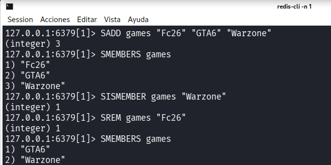

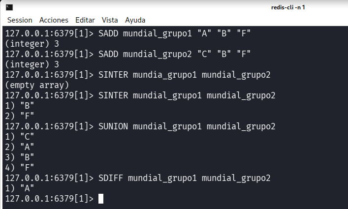

* ### Hashes

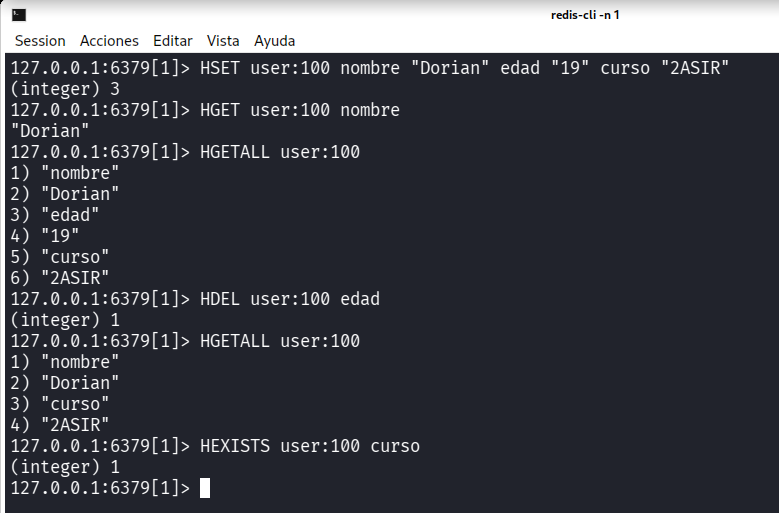

* ### Administración de bases de datos

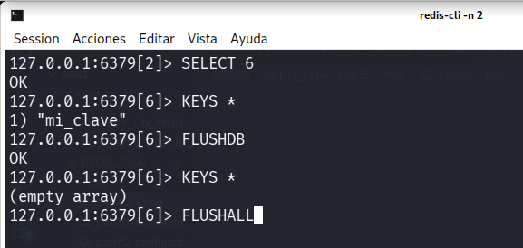

* ### Información y monitoreo

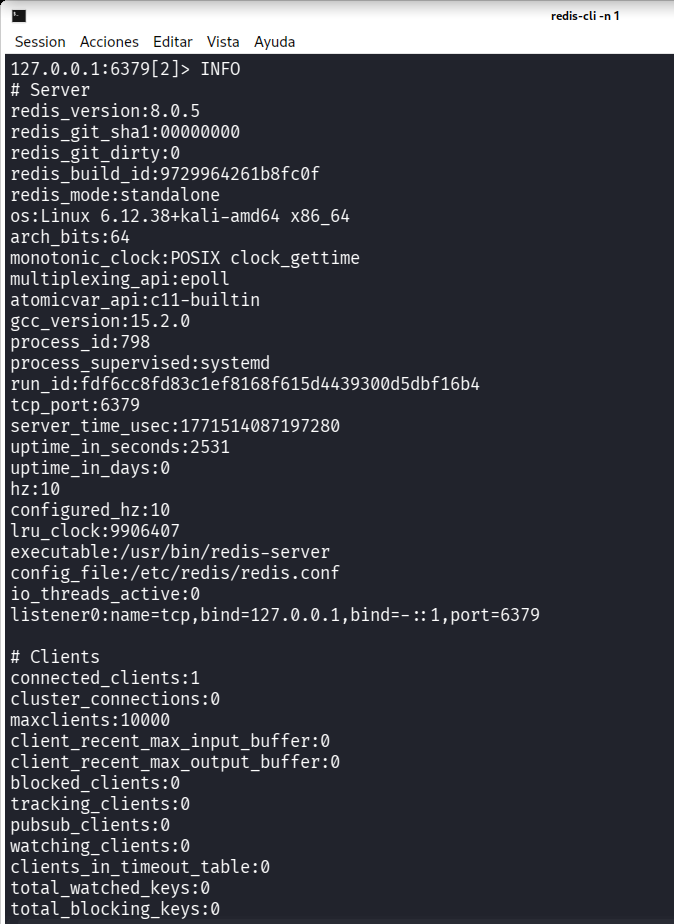

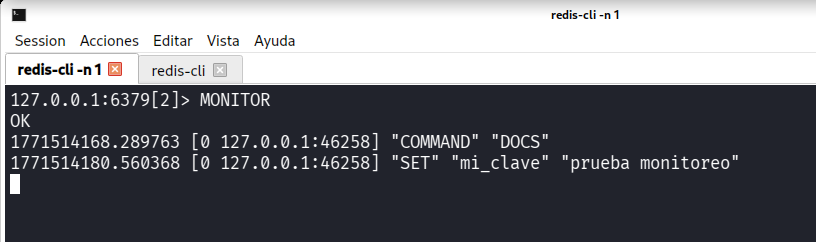

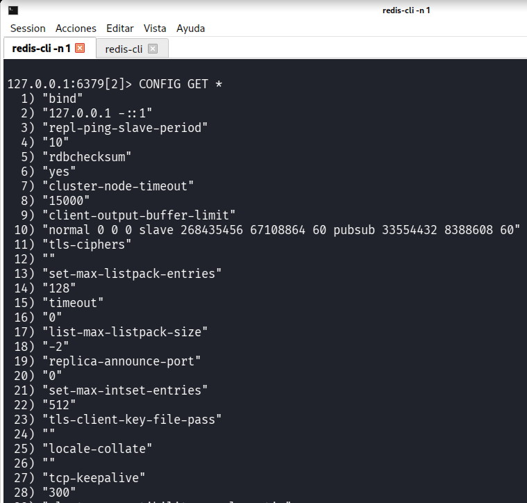

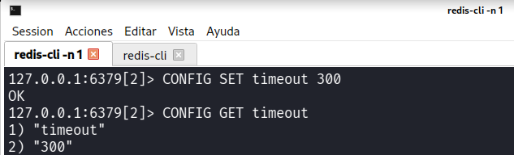

* ### Copias de seguridad y restauración

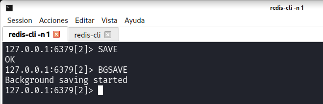

___

## Parte 3: Uso de un cliente visual

### 1. Instalar RedisInsight (cliente visual oficial)

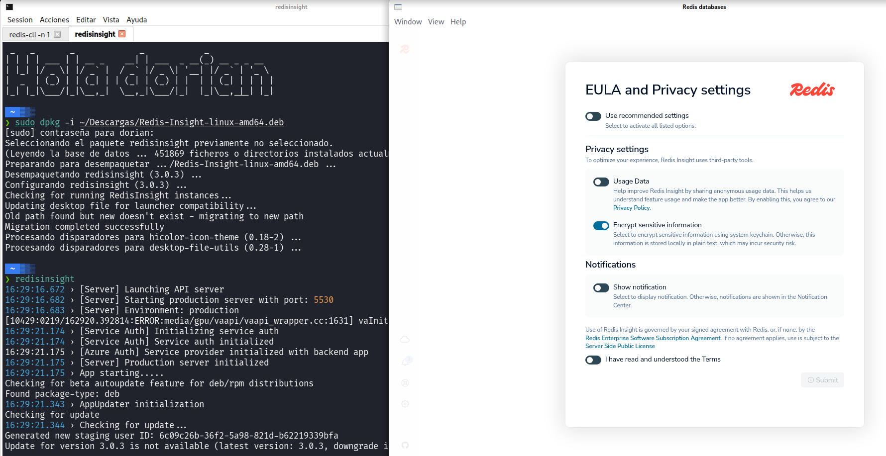

### 2. Explorar Redis desde RedisInsight

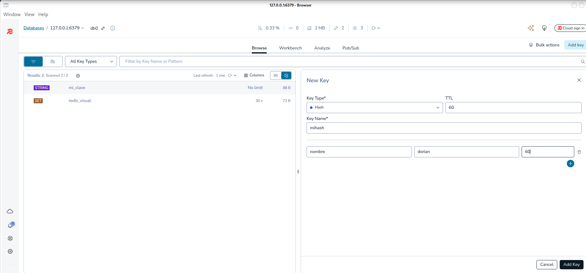

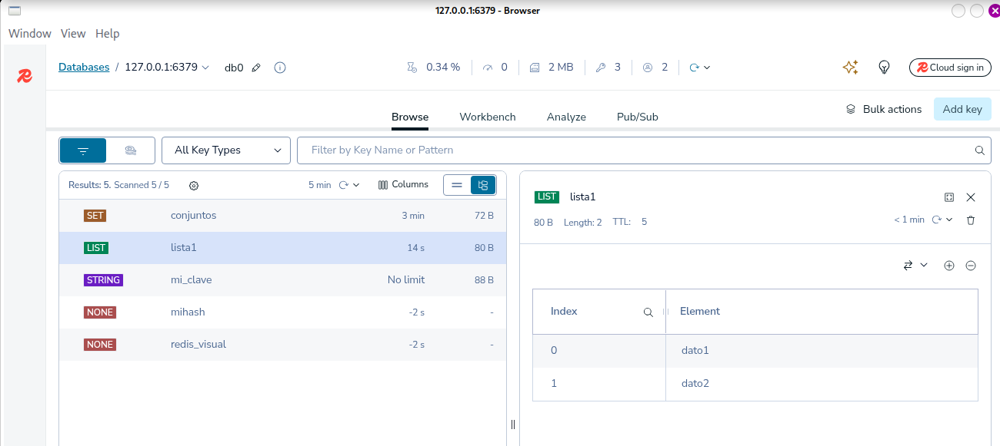

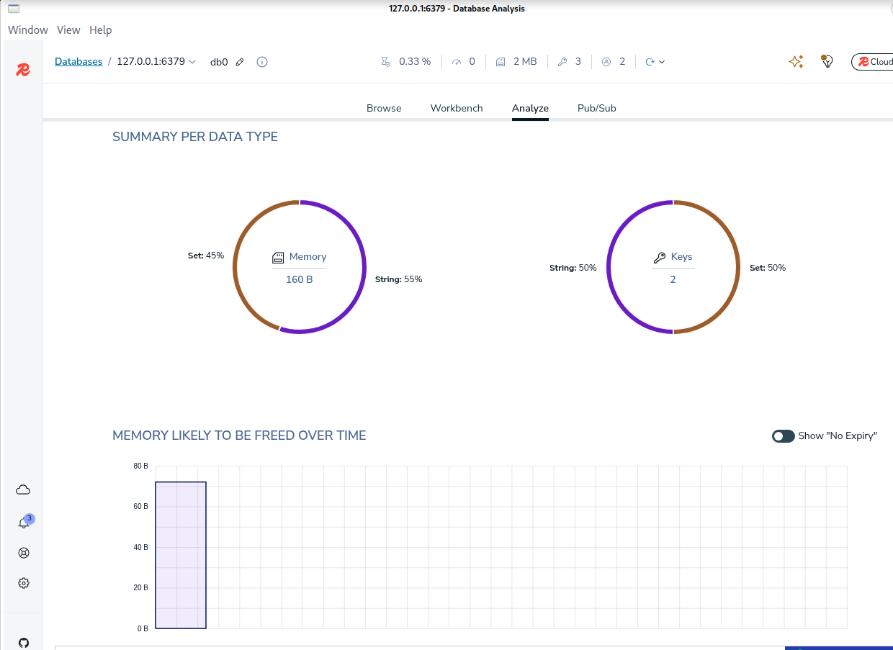

___

## Parte 4: Otro ejercicio

### 1. Operaciones y Simular carrito de compras

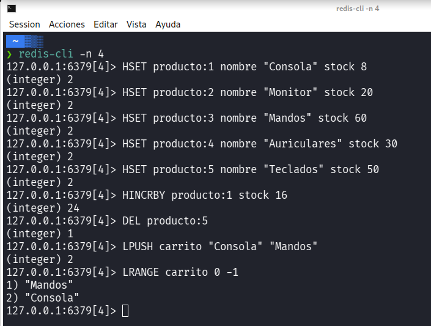

### 2. Ranking de usuarios

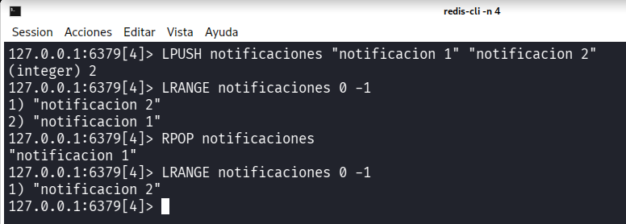

### 3.  Simulación de notificaciones

___

## Parte 5: Otro Ejercicio Más

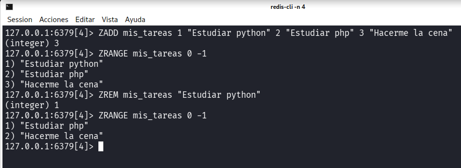