# GESTIÓN Y CONFIGURACION DE BASES DE DATOS SQLite

## INSTALACION DE SQLITE3

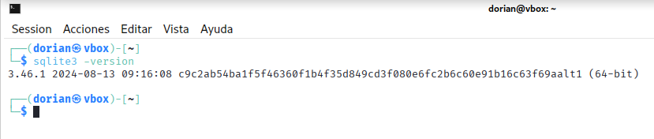

## **1. Configuración de la base de datos**

### 1.1. Creación de tablas y estructura

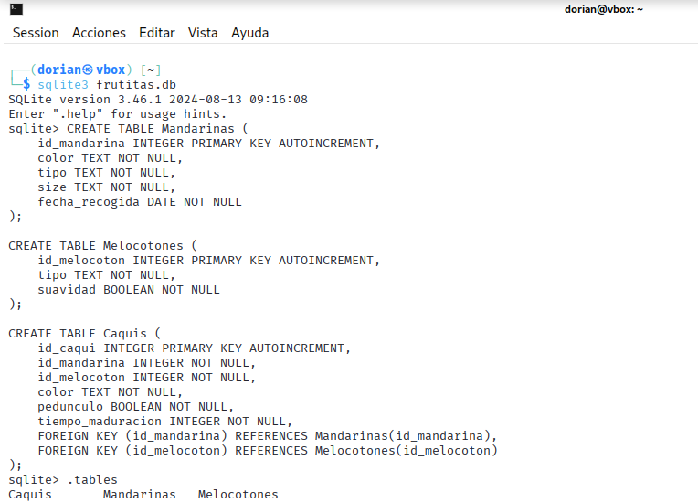

### 1.2. Tamaño y más

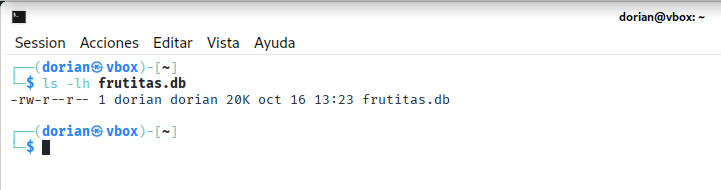

El tamaño de la base de datos aumentará  con cada INSERT de datos realizada en las tablas. Como
DBA, podría monitorizar el tamaño del fichero de la base de datos y planificar la optimización
de consultas para que la aplicación siga siendo rápida y eficiente.

## **2. Optimización del rendimiento y mantenimiento**

**ANALISIS DE PROBLEMAS:** He visto que en frutitas.log se repite de forma exhaustiva las consultas a la tabla Mandarinas por lo que es conveniente crear indices para optimizar y mejorar estas consultas.

### 2.1 Crear un índice en la columna color de la tabla Mandarinas:

Creo un indice en color de la tabla mandarinas ya que la consulta SELECT color FROM Mandarinas WHERE color = 'verde'; es muy repetida en el arhcivo de logs lo que acelerará las consultas

#### Sin optimizar

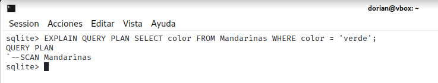

#### Optimizado

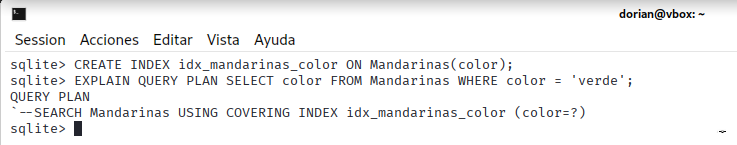

### 2.2 Crear un índice en la columna tamaño de la tabla Mandarinas:

Al igual que con la columna color, en la columna tamaño de la tabla de Mandarinas se repite mucho la consulta SELECT tamaño FROM Mandarinas WHERE tamaño = 'grande'; por lo que seria conveniente también crear un indice

#### Sin optimizar

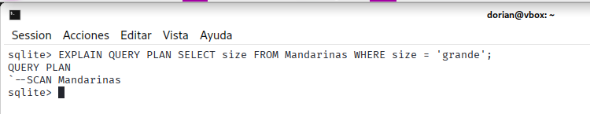

#### Optimizado

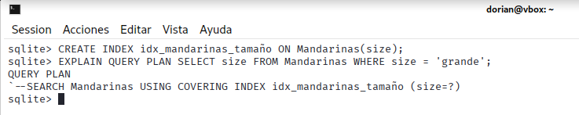

### 2.3 Crear un índice en la columna fecha_recogida de la tabla Mandarinas:

Por último me percaté que las consultas de rango sobre fechas que se repiten mucho se beneficiarían enormemente de los índices ayudando con la optimización.

#### Sin optimizar

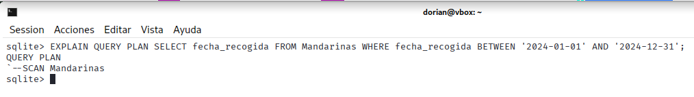

#### Optimizado

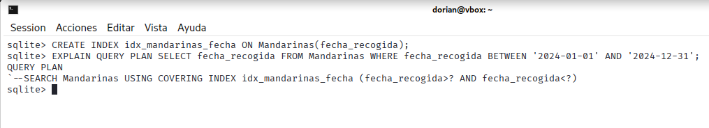

## **3. Copias de seguridad y restauración**

### 3.1 Copia de seguridad con el nombre frutitas_bonitas_bonitas.db

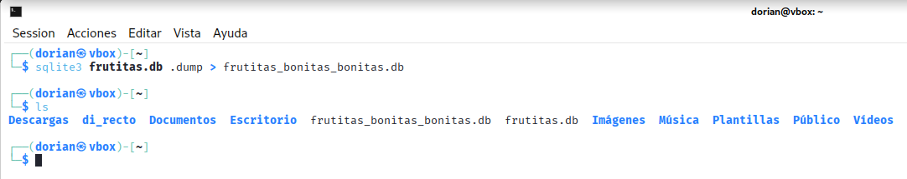

### 3.2 Restauración desde la copia de seguridad

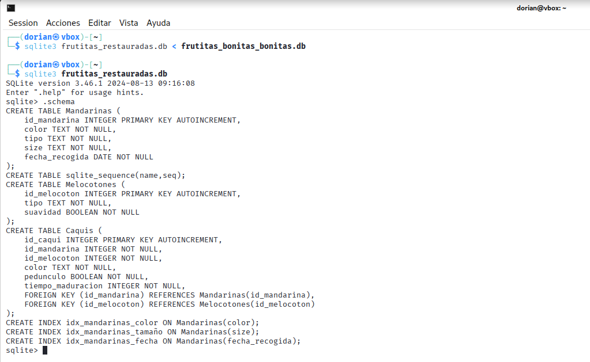

### 3.3 Automatización de backups 

#### Creacion del script en script_frutitas.sh:

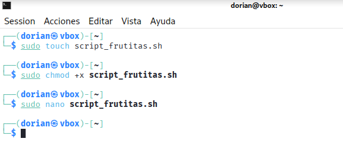
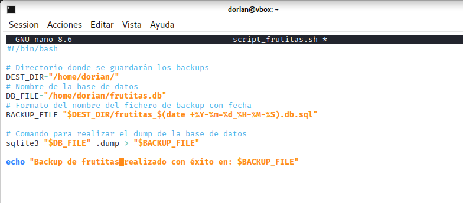

#### Programación de la tarea con cron:

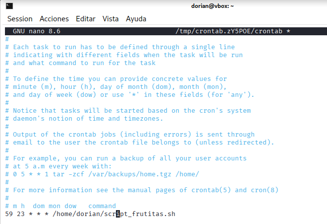
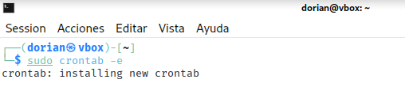

## **4. Preguntas**

#### ¿Cómo impactan los cambios en el PRAGMA en el rendimiento y la seguridad de la base de datos?

Los cambios en el PRAGMA podrían resultar muy beneficiosos para mejorar el rendimiento con mayores velocidades de escritura,lectura o mejorando la concurrencia. Por otro lado en la seguridad puede llegar a mejorar la integridad de los datos por ejemplo activando la verificación de claves foráneas o incluso llegando a cifrar la base de datos por completo.

#### ¿Qué mecanismos adicionales usarías para proteger una base de datos SQLite en un entorno de producción?

Ademas de usar los PRAGMA podria limitar el acceso al archivo de la base de datos estableciendo permisos unicamente al usuario o servicio que lo ejecuta(principio de mínimo privilegio), cifrar la base de datos usando algunas extensiones como SQLCipher, y llevar una auditoria de la base de datos con los logs.

#### ¿Qué diferencia hay entre los modos de journaling como DELETE, TRUNCATE y WAL en SQLite?

La principal diferencia es que mientras que con DELETE Y TRUNCATE no se puede leer mientras se escribe y viceversa, con WAL el método más moderno y de mayor rendimiento se pueden realizar las operaciones de lectura y escritura simultaneamente ya que los cambios se guardan en un fichero aparte y no directamente sobre la base de datos, esto mejora enormemente la concurrencia.  