## INSTALACIONES PYDICTOR Y DYMERGE

### PYDICTOR

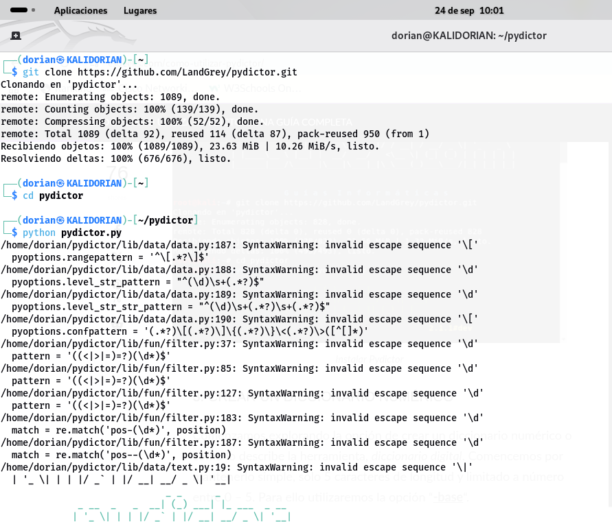

### DYMERGE

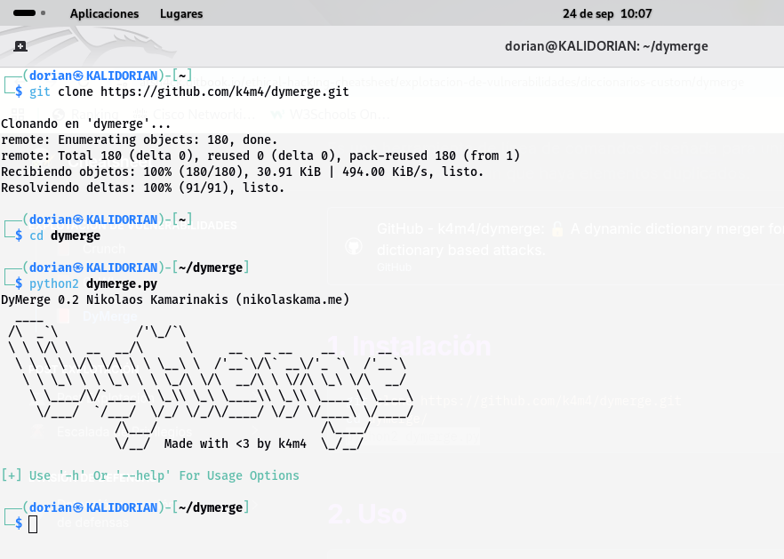

## CREACIÓN DE DICCIONARIOS

### DICCIONARIO DE NUMEROS

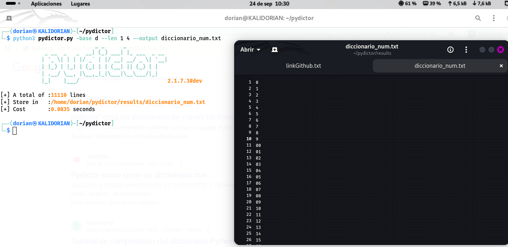

### DICCIONARIO DE LETRAS MAYÚSCULAS

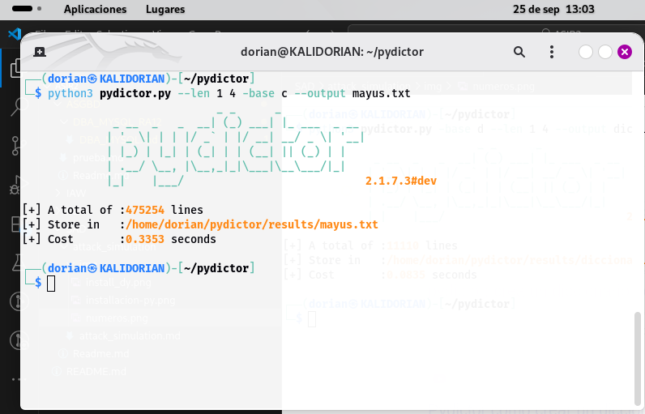

### UNIÓN DE DICCIONARIOS CON DYMERGE

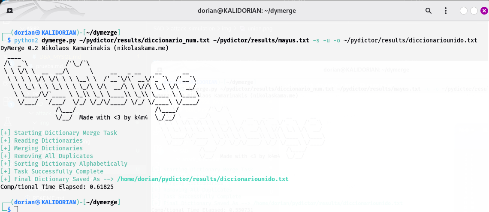

## SIMULACION DE UN ATAQUE 

### INSTALACION DE SSH Y DE HYDRA

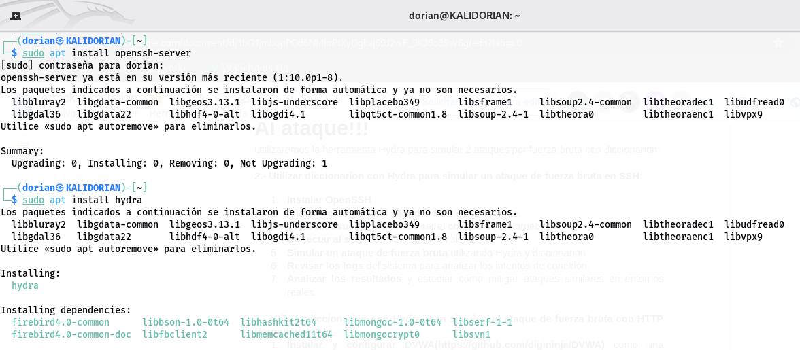

### HABILITACIÓN DE SSH 

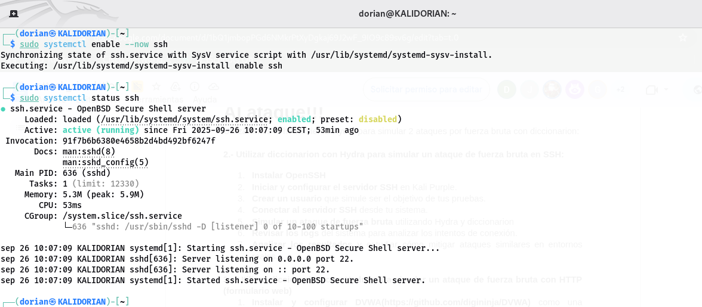

### CREACION DE USUARIO OBJETIVO 

**USUARIO:** objetivo
**CONTRASEÑA:** 0000

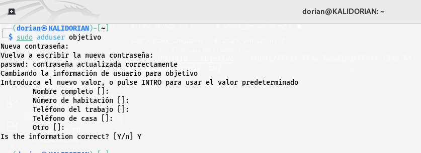

### SIMULACION DEL ATAQUE CON HYDRA

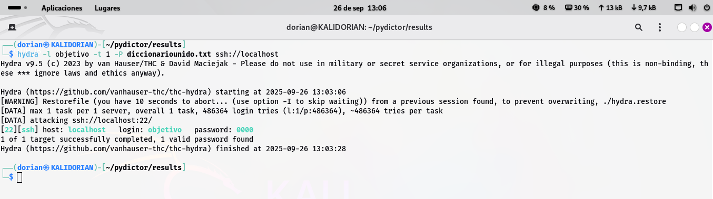

### REVISION DE LOGS

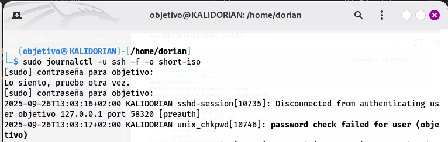
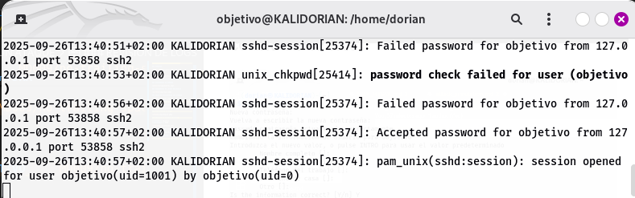

## COMO MITIGAR ESTOS ATAQUES

#### 1-Actualizar regularmente la configuración SSH

#### 2-Deshabilitar el Inicio de Sesión de Root

#### 3-Implementar Autenticación Basada en Claves en SSH

#### 4-Usar contraseñas fuertes y únicas

#### 5-Instalar Fail2Ban 

#### 6-Implementar el principio de privilegio mínimo

## ATAQUE DE FUERZA BRUTA CON HTTP

### INSTALACIÓN Y CONFIGURACIÓN DE DVWA

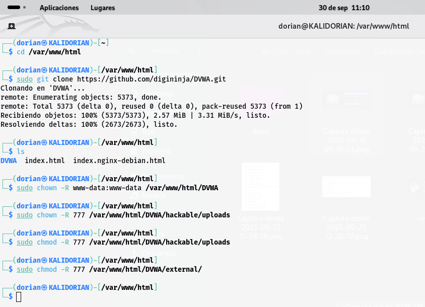
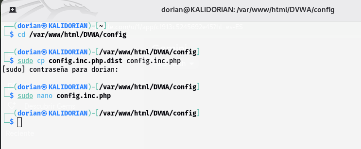
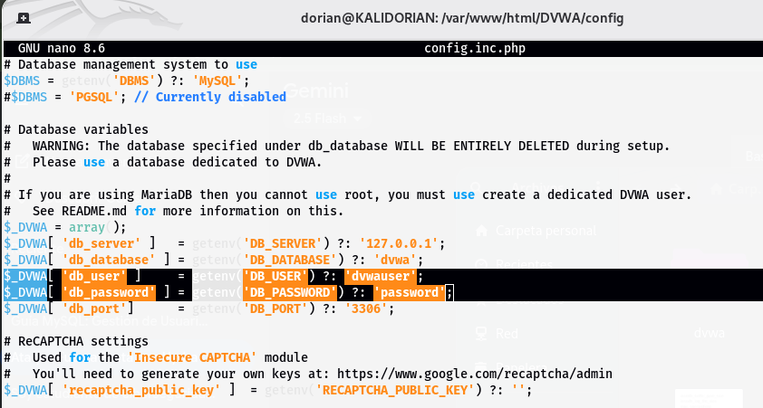

### INSTALACIÓN DE DOCKER E INICIALIZACIÓN DE DVWA

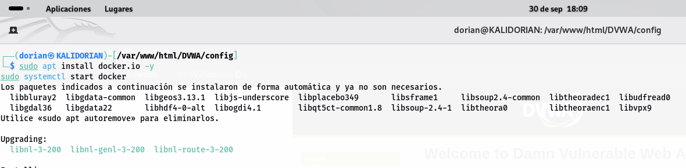
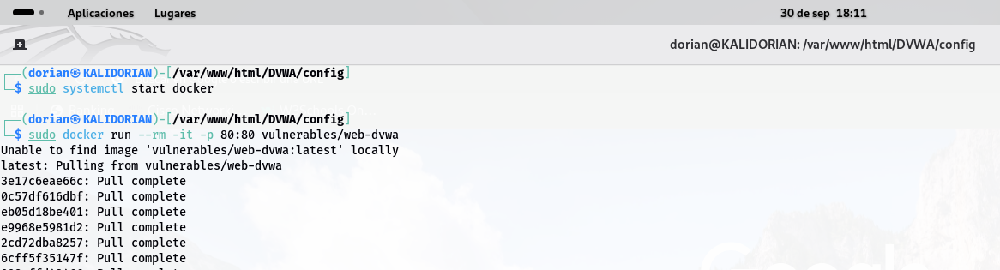
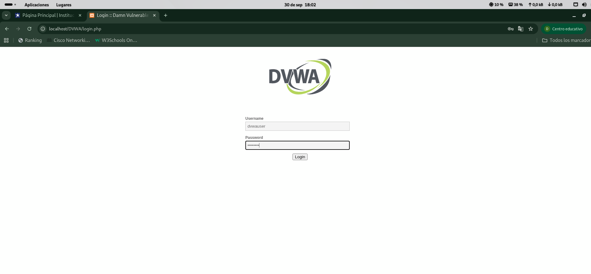

### ATAQUE CON HYDRA 

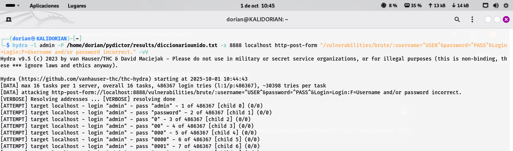

## COMO MITIGAR ESTOS ATAQUES

### 1. Política de Contraseñas Seguras

Implementar una política de contraseñas robusta es la primera línea de defensa contra ataques de fuerza bruta.

**Características de una contraseña segura:**
- **Longitud mínima:** 12-16 caracteres
- **Complejidad:** Combinación de mayúsculas, minúsculas, números y símbolos especiales
- **Sin patrones comunes:** Evitar palabras del diccionario, fechas de nacimiento o secuencias
- **Rotación periódica:** Cambiar contraseñas cada 90 días (especialmente en cuentas críticas)

**Ejemplo de configuración en Apache `.htaccess`:**
```apache
# Agregar headers de seguridad
Header set X-Frame-Options "SAMEORIGIN"
Header set X-Content-Type-Options "nosniff"
Header set X-XSS-Protection "1; mode=block"
```

**Herramientas recomendadas:**
- Gestores de contraseñas: **Bitwarden**, **KeePass**, **1Password**
- Generadores de contraseñas seguras integrados en navegadores modernos

---

### 2. Limitar los Intentos de Inicio de Sesión

Restringir el número de intentos fallidos es crucial para detener ataques automatizados.

**Estrategias de implementación:**

#### a) **Rate Limiting a nivel de aplicación**
Implementar bloqueos temporales tras múltiples intentos fallidos:
- **3 intentos fallidos:** Bloqueo de 5 minutos
- **5 intentos fallidos:** Bloqueo de 30 minutos  
- **10 intentos fallidos:** Bloqueo de 24 horas

#### b) **Configuración con Fail2Ban** (para aplicaciones web)
```bash
# Instalar Fail2Ban
sudo apt install fail2ban

# Crear configuración personalizada para HTTP
sudo nano /etc/fail2ban/jail.local
```

**Ejemplo de configuración (`jail.local`):**
```ini
[http-auth]
enabled = true
port = http,https
filter = apache-auth
logpath = /var/log/apache*/*error.log
maxretry = 3
bantime = 3600
findtime = 600
```

#### c) **Rate Limiting con Nginx**
```nginx
# En nginx.conf
http {
    limit_req_zone $binary_remote_addr zone=loginlimit:10m rate=5r/m;
    
    server {
        location /login {
            limit_req zone=loginlimit burst=3 nodelay;
        }
    }
}
```

---

### 3. Autenticación Multifactor (MFA)

La MFA añade una capa adicional de seguridad que hace prácticamente imposible el acceso no autorizado incluso con contraseñas comprometidas.

**Tipos de MFA recomendados:**

#### a) **TOTP (Time-based One-Time Password)**
- **Aplicaciones:** Google Authenticator, Microsoft Authenticator, Authy
- **Ventaja:** No requiere conectividad a Internet tras la configuración inicial

#### b) **SMS/Email (menos seguro pero mejor que nada)**
- Envío de códigos de un solo uso
- **Limitación:** Vulnerable a ataques de SIM swapping

#### c) **Llaves de seguridad físicas**
- **Estándar:** FIDO2/WebAuthn
- **Dispositivos:** YubiKey, Google Titan Key
- **Máxima seguridad:** Resistente a phishing

**Implementación básica con PHP (ejemplo conceptual):**
```php
<?php
// Verificar TOTP
require 'vendor/autoload.php';
use OTPHP\TOTP;

$totp = TOTP::create($secret);
if ($totp->verify($userInput)) {
    // Código correcto
    echo "Autenticación exitosa";
} else {
    // Código incorrecto
    echo "Código MFA inválido";
}
?>
```

---

### 4. Usar CAPTCHA y reCAPTCHA

Los CAPTCHA previenen ataques automatizados al verificar que el usuario es humano.

#### a) **Google reCAPTCHA v3** (Recomendado)
- **Ventaja:** Invisible, basado en comportamiento
- **Sin fricción:** No requiere que el usuario haga clic en nada

**Implementación:**

1. **Registrar el sitio en** [Google reCAPTCHA](https://www.google.com/recaptcha/admin)

2. **Añadir script en el HTML:**
```html
<script src="https://www.google.com/recaptcha/api.js?render=TU_SITE_KEY"></script>
<script>
grecaptcha.ready(function() {
    grecaptcha.execute('TU_SITE_KEY', {action: 'login'}).then(function(token) {
        document.getElementById('recaptchaResponse').value = token;
    });
});
</script>
```

3. **Validar en el servidor (PHP):**
```php
<?php
$recaptcha_secret = 'TU_SECRET_KEY';
$recaptcha_response = $_POST['recaptchaResponse'];

$url = 'https://www.google.com/recaptcha/api/siteverify';
$data = array(
    'secret' => $recaptcha_secret,
    'response' => $recaptcha_response
);

$options = array(
    'http' => array(
        'method' => 'POST',
        'content' => http_build_query($data)
    )
);

$context = stream_context_create($options);
$verify = file_get_contents($url, false, $context);
$captcha_success = json_decode($verify);

if ($captcha_success->success && $captcha_success->score >= 0.5) {
    // Usuario verificado
    echo "CAPTCHA válido";
} else {
    // Posible bot
    echo "Verificación CAPTCHA fallida";
}
?>
```

#### b) **hCaptcha** (Alternativa enfocada en privacidad)
- Compatible con reCAPTCHA en la mayoría de APIs
- Mayor respeto a la privacidad del usuario

#### c) **CAPTCHA personalizado**
- Preguntas matemáticas simples
- Selección de imágenes
- **Limitación:** Menos efectivo contra bots avanzados

---

### 5. Medidas Adicionales Recomendadas

#### **Monitorización y Alertas**
```bash
# Monitorear logs en tiempo real
tail -f /var/log/apache2/access.log | grep "POST /login"

# Configurar alertas con logwatch
sudo apt install logwatch
sudo logwatch --detail High --service http --range today
```

#### **Bloqueo por Geolocalización**
Restringir acceso desde países de alto riesgo si tu aplicación solo opera localmente.

#### **WAF (Web Application Firewall)**
- **ModSecurity** con Apache/Nginx
- **Cloudflare WAF** (solución en la nube)

#### **HTTPS obligatorio**
```apache
# Forzar HTTPS en .htaccess
RewriteEngine On
RewriteCond %{HTTPS} off
RewriteRule ^(.*)$ https://%{HTTP_HOST}%{REQUEST_URI} [L,R=301]
```
