# Desafío 1: Configuracion DMZ, Firewall Y Cliente Interno


## 1. Introducción y Topología

El objetivo de esta práctica es desplegar una arquitectura de red segmentada para proteger los servicios internos y expuestos. Se implementará una zona desmilitarizada (**DMZ**) utilizando dos firewalls **pfSense** en cascada, aislando la red **LAN** interna de la red externa (WAN/Internet).

### Esquema de Direccionamiento IP 

| Dispositivo | Interfaz / Rol | Red VirtualBox | Dirección IP / CIDR | Gateway (Puerta de Enlace) |
| :--- | :--- | :--- | :--- | :--- |
| **FW1 (Perímetro)** | WAN (`em0`) | NAT | DHCP (10.0.x.x) | *Automático (ISP)* |
| | LAN (`em1`) | Red Interna: `DMZ` | `192.168.1.1/24` | - |
| **FW2 (Interno)** | WAN (`em0`) | Red Interna: `DMZ` | `192.168.1.2/24` | `192.168.1.1` (FW1) |
| | LAN (`em1`) | Red Interna: `LAN` | `192.168.0.1/24` | - |
| **Servidor VPN** | Ethernet (`enp0s3`) | Red Interna: `DMZ` | `192.168.1.10/24` | `192.168.1.1` (FW1) |
| **Servidor Proxy** | Ethernet (`enp0s3`) | Red Interna: `LAN` | `192.168.0.10/24` | `192.168.0.1` (FW2) |
| **Cliente Interno** | Ethernet | Red Interna: `LAN` | `192.168.0.100/24` | `192.168.0.1` (FW2) |

---

## 2. Configuración del Hipervisor (VirtualBox)

En esta fase se definen los parámetros de hardware virtual y la conectividad lógica antes de la instalación de los sistemas operativos.

### 2.1. Máquina Virtual: FW1 (pfSense Externo)
* **SO:** FreeBSD (64-bit).
* **Recursos:** 1 vCPU, 1024 MB RAM, 20 GB HDD.
* **Configuración de Red:**
    * **Adaptador 1:** Conectado a **NAT** (Salida a Internet).
    * **Adaptador 2:** Conectado a **Red Interna**, Nombre: `DMZ`.

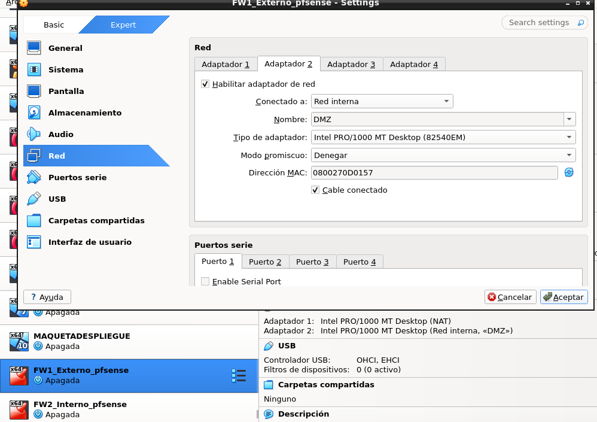

### 2.2. Máquina Virtual: FW2 (pfSense Interno)
* **SO:** FreeBSD (64-bit).
* **Recursos:** 1 vCPU, 1024 MB RAM, 20 GB HDD.
* **Configuración de Red:**
    * **Adaptador 1:** Conectado a **Red Interna**, Nombre: `DMZ` (Conexión hacia FW1).
    * **Adaptador 2:** Conectado a **Red Interna**, Nombre: `LAN` (Conexión hacia Cliente).

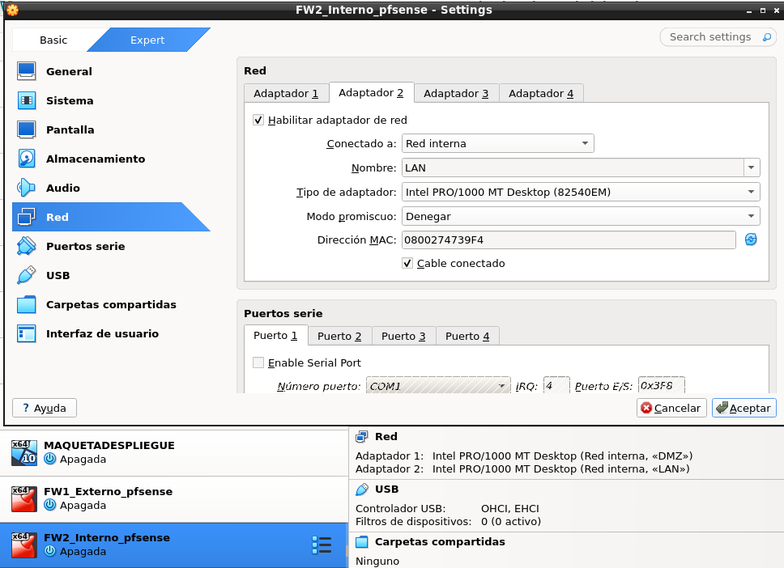

### 2.3. Máquina Virtual: Cliente Interno
* **SO:** Windows 10 Pro (64-bit).
* **Configuración de Red:**
    * **Adaptador 1:** Conectado a **Red Interna**, Nombre: `LAN`.
    * **Modo Promiscuo:** Permitir todo.

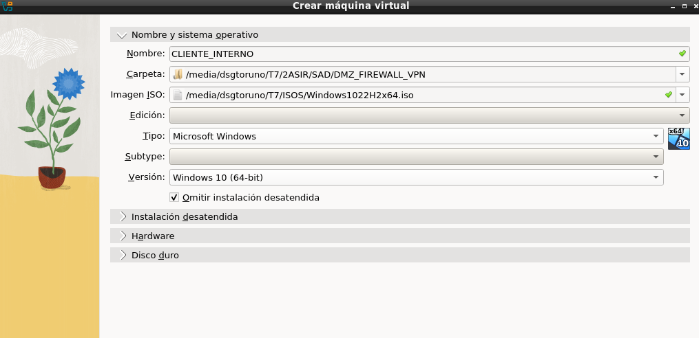

---

## 3. Instalación y Configuración Base de Firewalls

### 3.1. FW1: Firewall Externo (Perímetro)
Durante la instalación, configuro las interfaces para establecer el borde de la red.

1.  **Asignación de Interfaces:**
    * WAN -> `em0` (DHCP Client).
    * LAN -> `em1` (Static IP: `192.168.1.1/24`).
2.  **Rutas Estáticas:** He añadido una ruta hacia la red `192.168.0.0/24` utilizando como gateway la IP del FW2 (`192.168.1.2`) para permitir el tráfico de retorno.

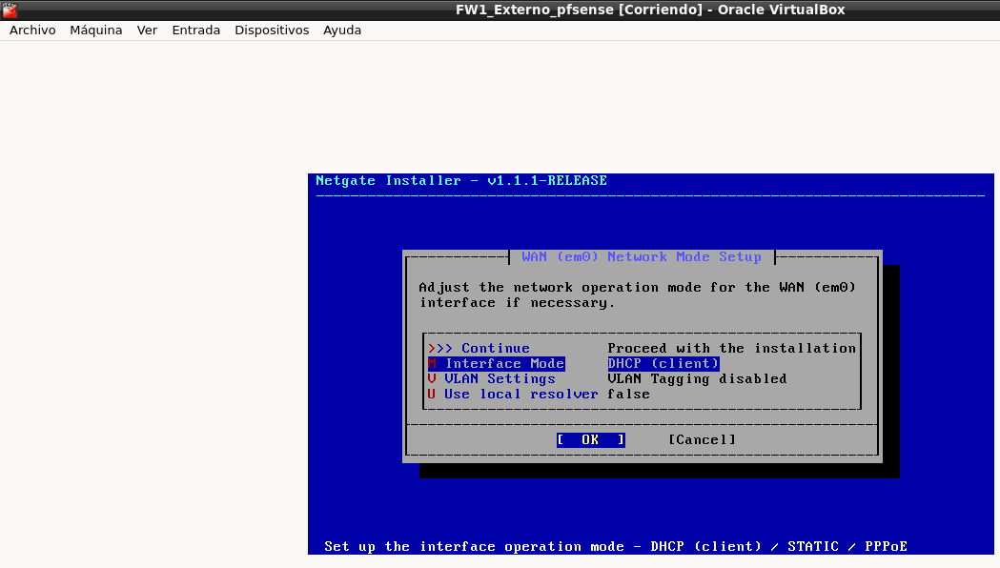
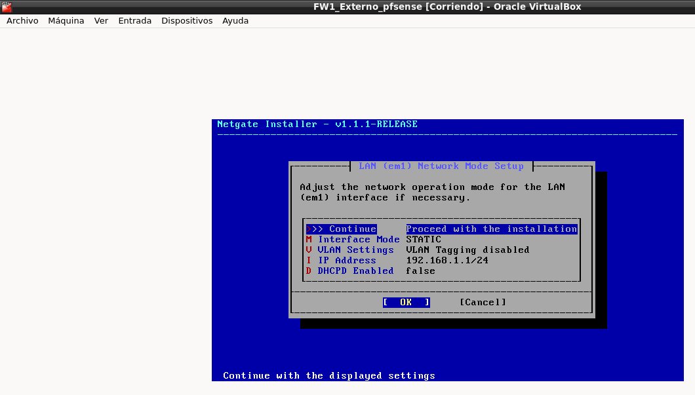
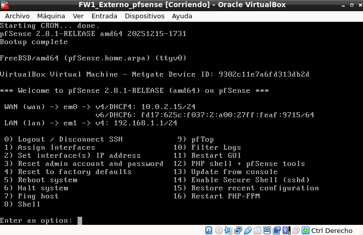

### 3.2. FW2: Firewall Interno (Segmentación)
Este dispositivo gestiona el tráfico entre la zona segura (LAN) y la zona intermedia (DMZ).

1.  **Configuración WAN (`em0`):** IP Estática `192.168.1.2/24`. Gateway: `192.168.1.1`.
2.  **Configuración LAN (`em1`):** IP Estática `192.168.0.1/24`.
3.  **Verificación:** Test de conectividad (Ping) desde FW2 hacia FW1 (`192.168.1.1`).

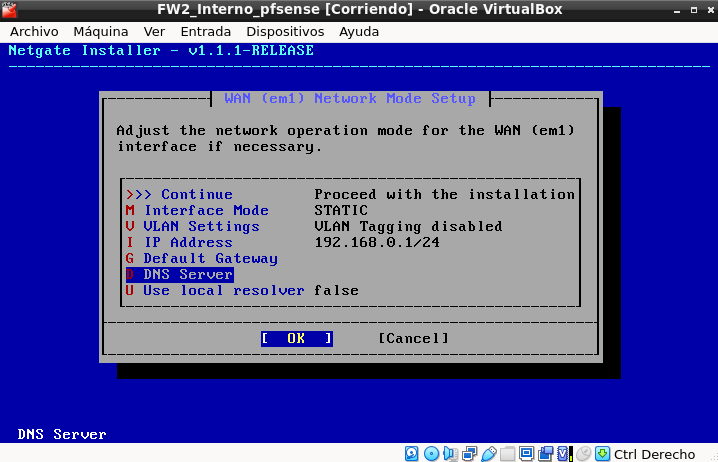
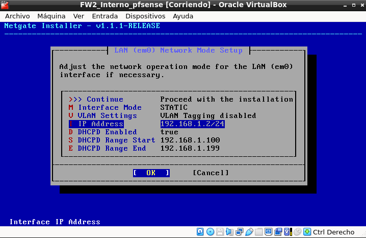
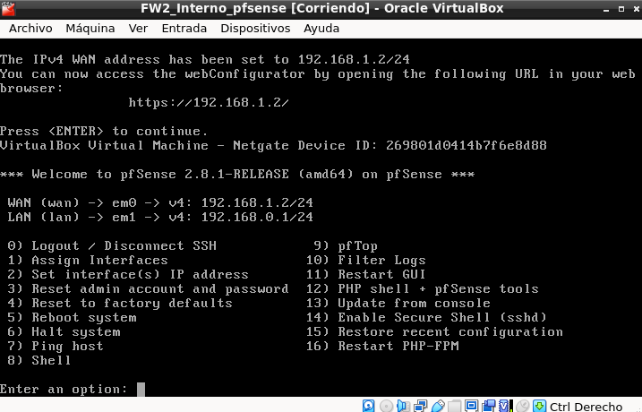
---

## 4. Configuración de Reglas y Políticas (FW1 Externo)

Configuración las reglas de acceso y la traducción de direcciones para permitir la conectividad de la DMZ y el acceso VPN.

* Primero para tener conexion con el fw1 desde el cliente interno he tenido que crear la ruta y desactivar el motor de filtrado de paquetes de forma **temporal** solo para dicha conexión y poder configurar las reglas de permiso definitivas.

**Desactivación del Filtrado:**
```bash
pfctl -d
```

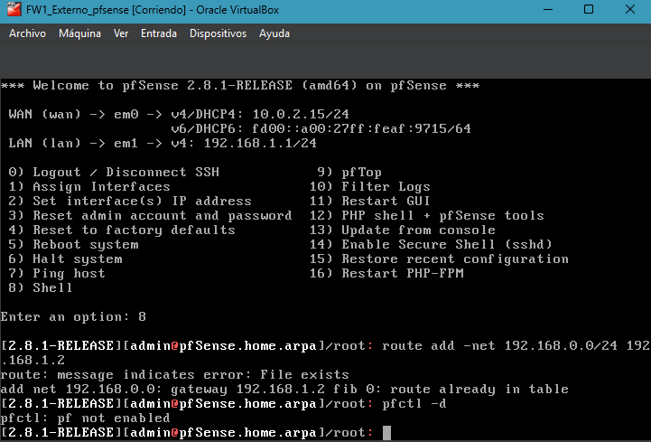

### 4.1. Configuración de NAT (Outbound)
 Configuración del NAT en modo **Híbrido** para permitir la salida a internet de la red DMZ.

* **Modo:** Hybrid Outbound NAT.
* **Regla:** Source `192.168.1.0/24` -> Translation `Interface Address`.

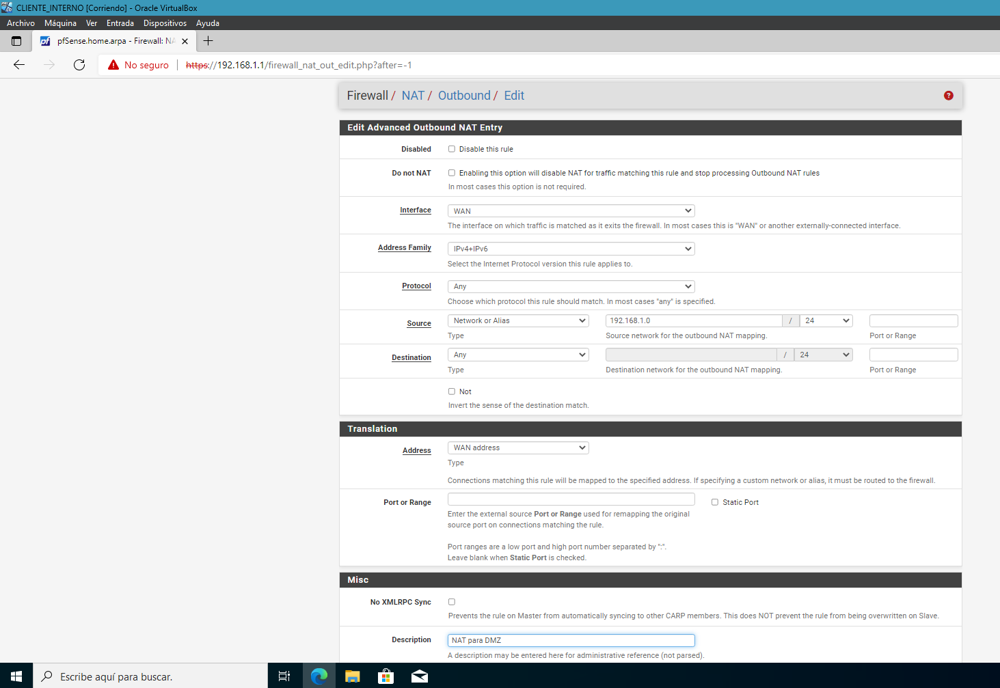

### 4.2. Reglas de Firewall 1 (WAN y LAN/DMZ)

**A) Interfaz WAN: Acceso VPN**
Se permite el tráfico entrante para el futuro servidor OpenVPN.
* **Acción:** Pass | **Protocolo:** UDP | **Destino:** `192.168.1.10` (Puerto 1194).

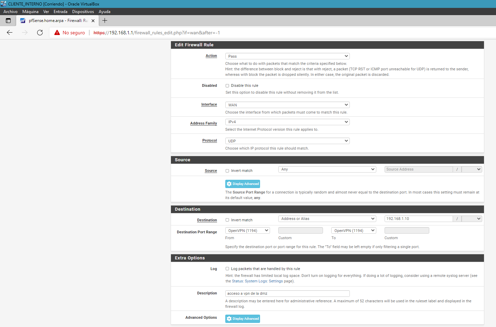

**B) Interfaz LAN (Zona DMZ): Seguridad y Salida**
Me he centrado en el orden de las reglas: primero se bloquea el acceso a la red interna y luego se permite la navegación.

1.  **Bloqueo de Seguridad:** Se impide que la DMZ acceda a la red LAN (`192.168.0.0/24`).
    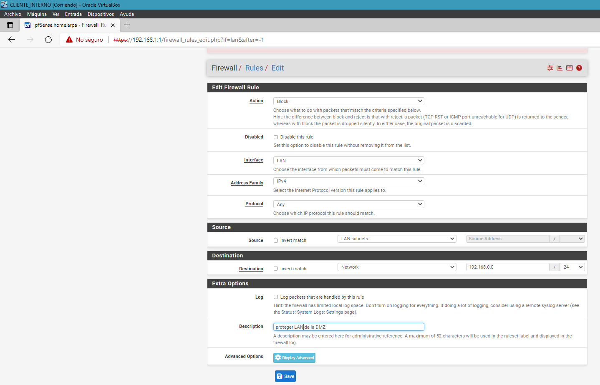

2.  **Salida a Internet:** Se permite el tráfico desde la DMZ hacia Internet.
    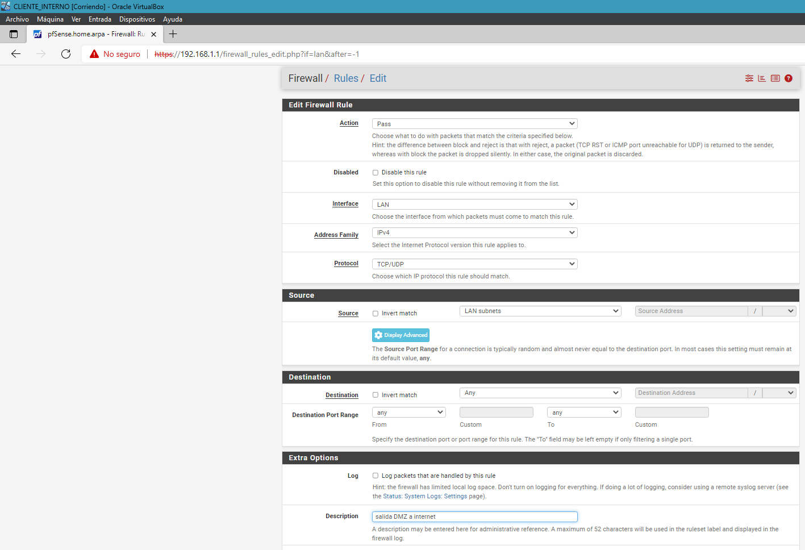


* Por último hay una vez ya configurado el firewall revertimos el comando pfctl -d con pfctl -e ,es decir, reactivar el motor de filtrado. Esto es crucial para restaurar la seguridad del perímetro y asegurar que el tráfico se gestione según las reglas recién configuradas, eliminando la vulnerabilidad del estado desactivado. 

**Reactivación del Filtrado:**
Una vez creadas las reglas de "Allow" en la interfaz web, se ejecutó inmediatamente:
```bash
pfctl -e
```
 
---

## 5. Configuración de Reglas y Políticas (FW2 Interno)

Este firewall protege la red LAN y gestiona el tráfico hacia el Proxy y desde la VPN.

### 5.1. Configuración de NAT
Verificación de que el NAT de salida esté en modo **Automático** para gestionar el tráfico de la LAN.

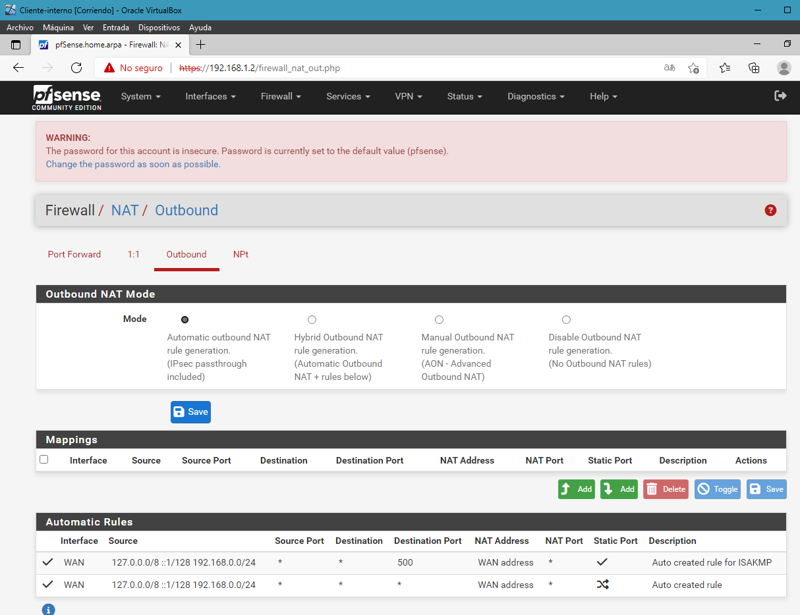

### 5.2. Reglas de la Interfaz LAN (Red Interna)

Configuración las reglas para el uso del Proxy y una regla de seguridad temporal.

1.  **Salida del Proxy:** Permite que el servidor Proxy (`192.168.0.10`) acceda a la web o internet (HTTP/HTTPS).
    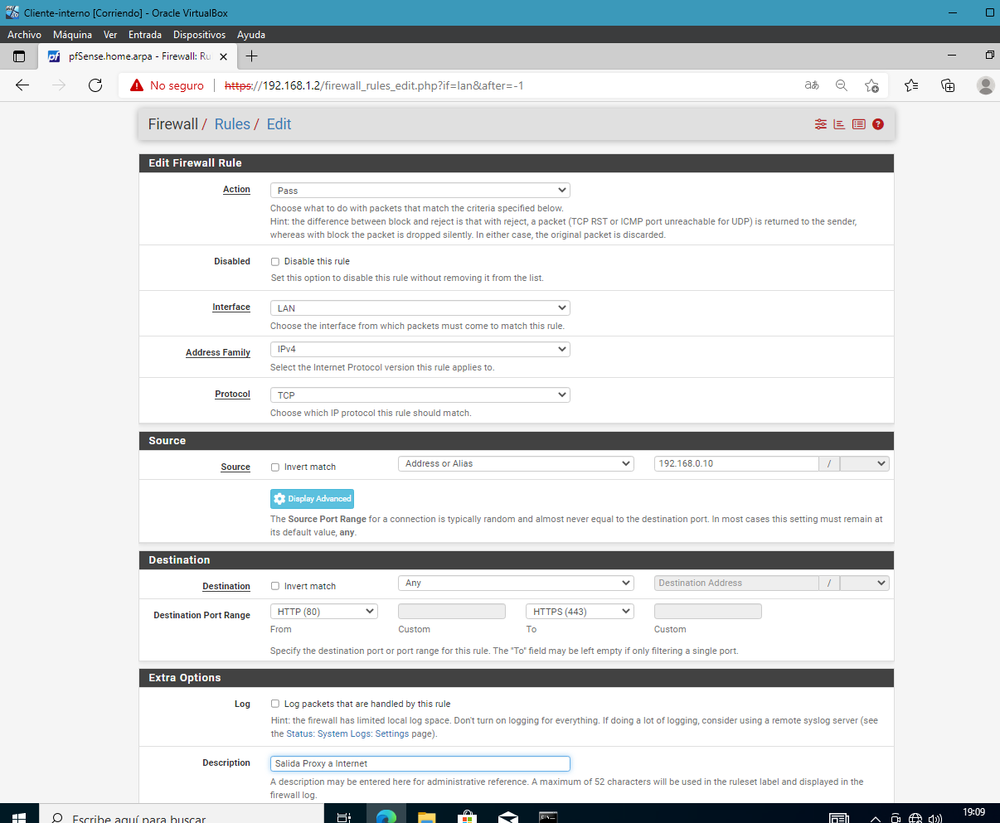

2.  **Acceso al Proxy:** Permite que los clientes de la LAN conecten al puerto `3128` del Proxy.
    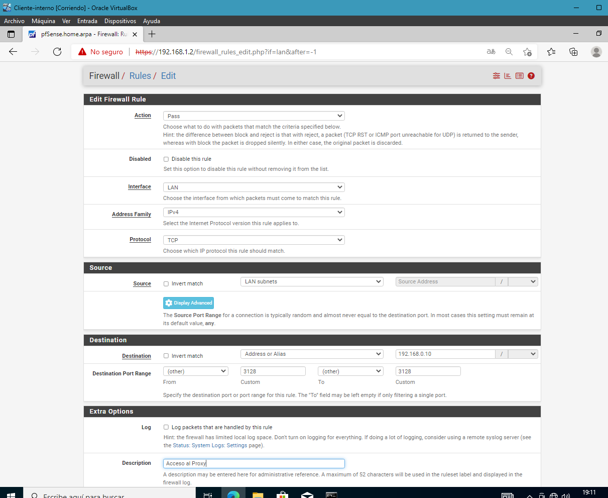

3.  **Regla de Navegación (Temporal):** Debido a que el servidor Proxy aún no está implementado, mantengo activa una regla "Default Allow LAN to any" para no perder conectividad durante el desarrollo de la práctica.
    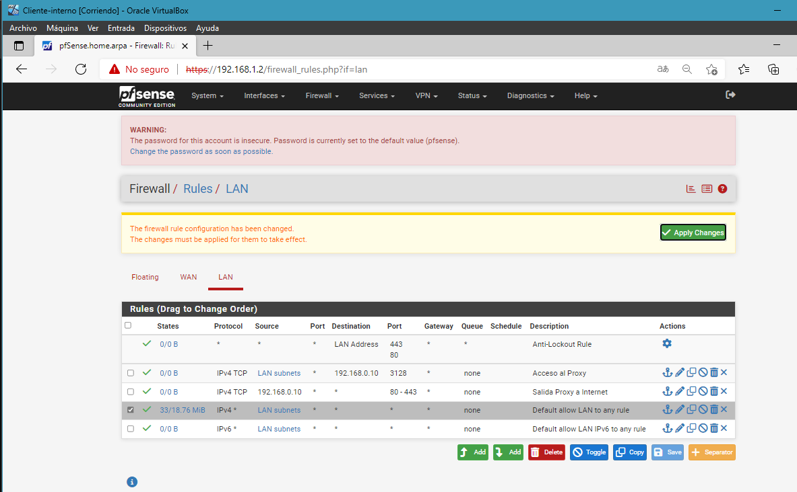

### 5.3. Reglas de la Interfaz WAN (Conexión a DMZ)

Estas reglas controlan el tráfico que entra desde la DMZ (ej. VPN) hacia la LAN.

1.  **Acceso VPN a Proxy:** Permite que los usuarios de la VPN (`192.168.1.10`) accedan al Proxy interno.
    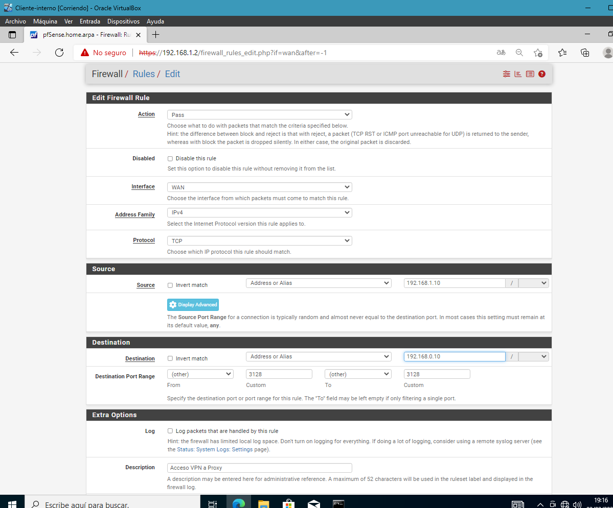

2.  **Bloqueo Total:** Se deniega cualquier otro tráfico desde la DMZ hacia la LAN por seguridad.
    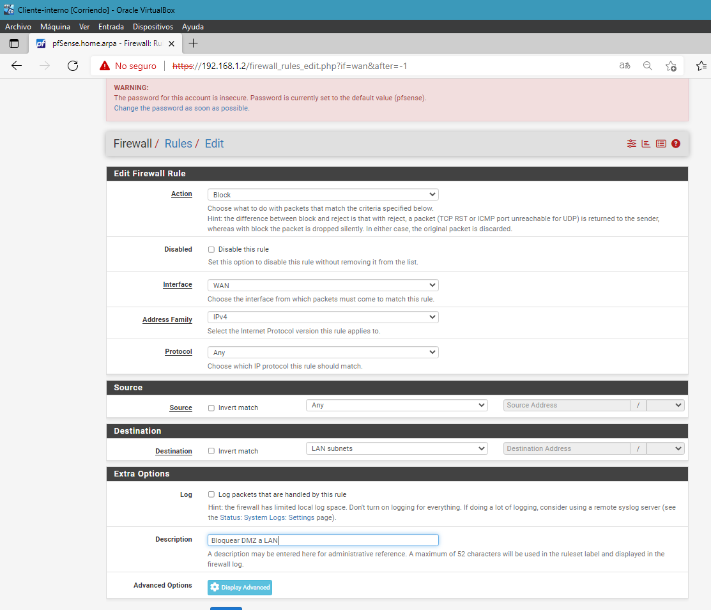

---

## 6. Configuración del Cliente Interno

Configuración del direccionamiento estático en Windows 10 Pro para asegurar la comunicación con el FW2.

* **Dirección IP:** `192.168.0.100`
* **Máscara:** `255.255.255.0`
* **Puerta de enlace:** `192.168.0.1`
* **DNS:** `8.8.8.8` / `8.8.4.4`

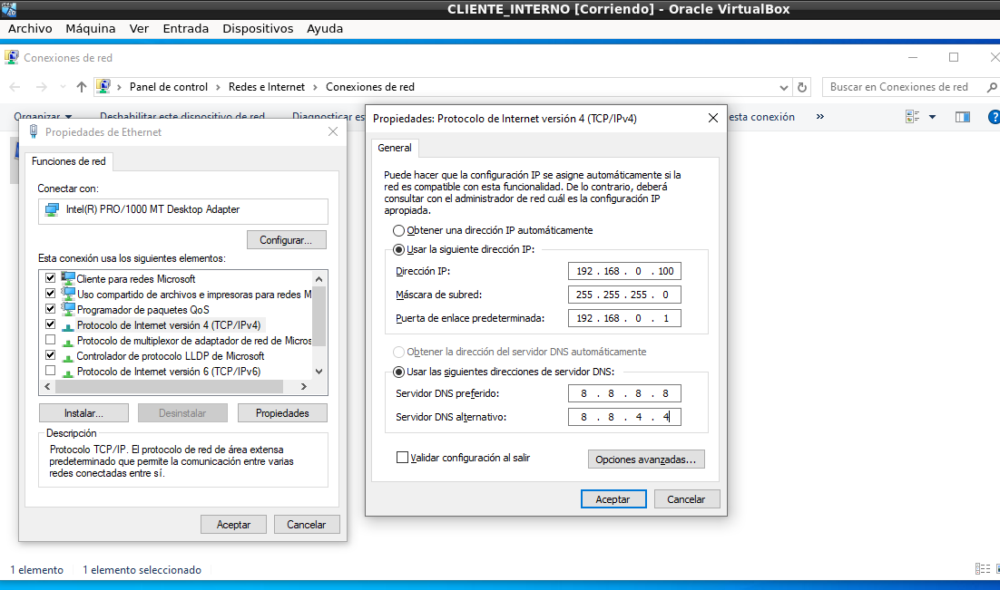

---

## 7. Pruebas de Validación y Acceso

Tras aplicar las configuraciones en ambos firewalls, realizo las pruebas de conectividad desde el **Cliente Interno**:

1.  **Ping al Gateway:** Verificación exitosa de conexión con el FW2 (`192.168.0.1`).
    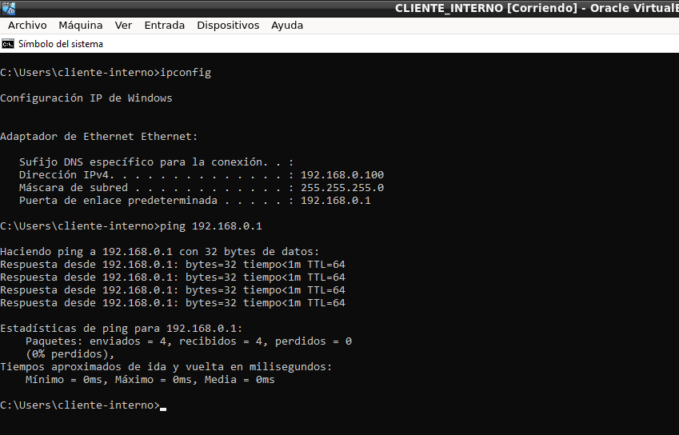

2.  **Acceso a Gestión:** Validación de acceso a la interfaz web de pfSense desde el navegador del cliente.
    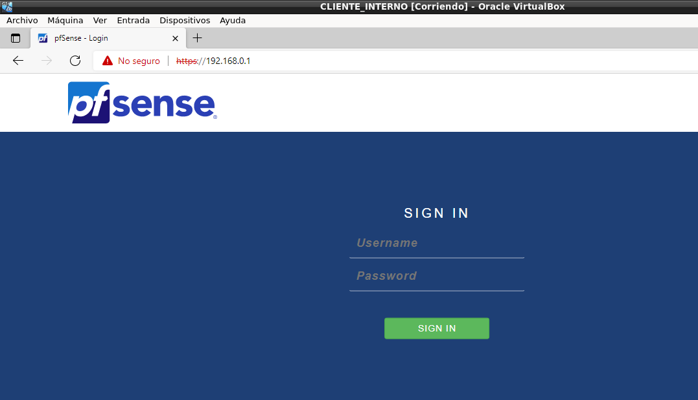

---

# Desafío 2: Implementación de Servicios de Red (Proxy y VPN)

## 1. Introducción y Objetivos

Se añaden dos servidores basados en **Ubuntu Server 22.04 LTS**:

1.  **Servidor Proxy (Squid):** Ubicado en la red interna (**LAN**) para filtrar la navegación web, optimizar el ancho de banda y aplicar políticas de acceso a los clientes internos.
2.  **Servidor VPN (OpenVPN):** Ubicado en la zona desmilitarizada (**DMZ**) para permitir conexiones seguras desde el exterior hacia la infraestructura interna, manteniendo el aislamiento de redes.

---

## 2. Despliegue de Servidores (VirtualBox)

Creación de las dos máquinas virtuales con ubuntu server para ejercer los roles de servidores dedicados.

### 2.1. Servidor Proxy (LAN)
* **Nombre de VM:** `SERVIDOR_PROXY`
* **Recursos:** 1 vCPU, RAM dinámica.
* **Red:** Adaptador 1 conectado a **Red interna: "LAN"**.

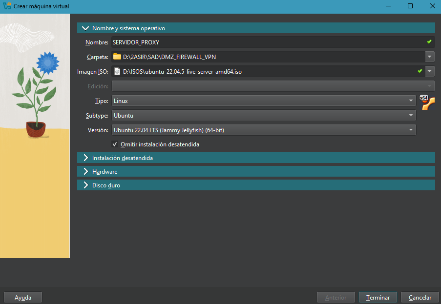

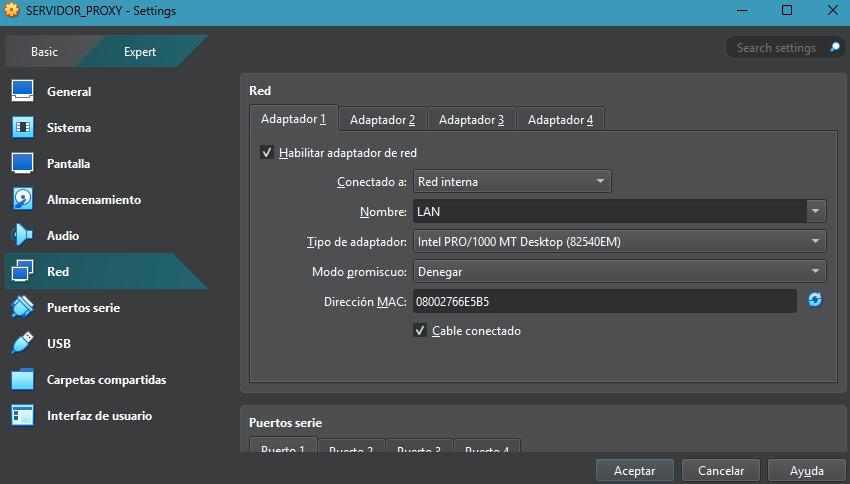

### 2.2. Servidor VPN (Zona DMZ)
* **Nombre de VM:** `SERVIDOR_VPN`
* **Recursos:** 1 vCPU, RAM dinámica.
* **Red:** Adaptador 1 conectado a **Red interna: "DMZ"**.


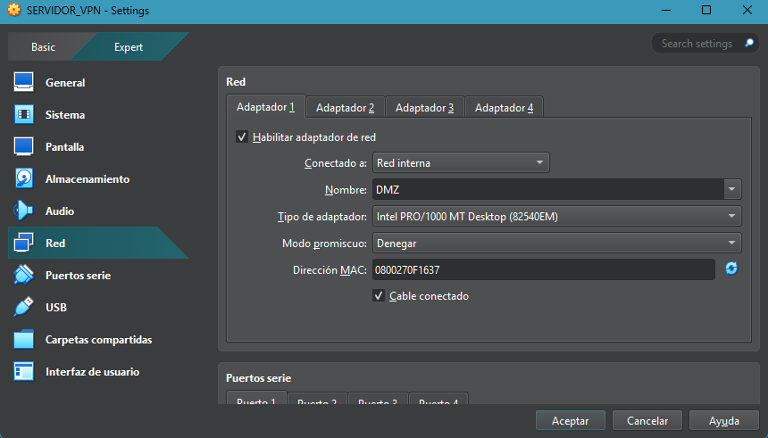

---

## 3. Configuración de Red (Netplan)

Configuración de las direcciones IP estáticas mediante **Netplan** para garantizar la persistencia y la correcta comunicación con los Gateways (Firewalls pfSense).

### 3.1. Configuración del Proxy (LAN)
Edito el archivo de configuración de red (ej. `/etc/netplan/50-cloud-init.yaml`) asignando la IP estática y apuntando al Gateway de la LAN (FW2).

* **IP:** `192.168.0.10/24`
* **Gateway:** `192.168.0.1`
* **DNS:** `8.8.8.8`

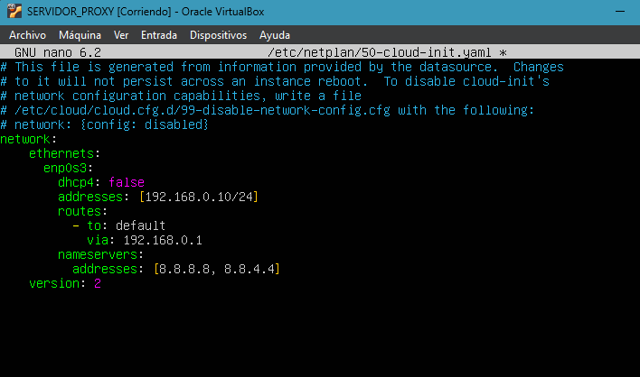

**Validación de conectividad:**
Verifico la salida a internet realizando un ping a `8.8.8.8` (tráfico enrutado por FW2 -> FW1 -> NAT).

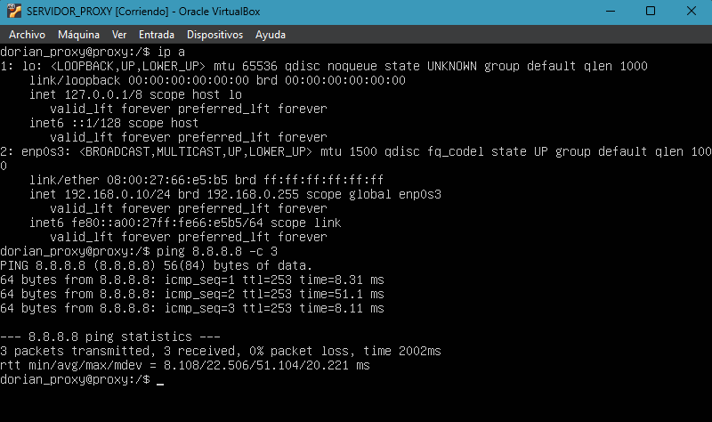

### 3.2. Configuración de la VPN (DMZ)
Configuración de la interfaz de red apuntando al Gateway de la DMZ (FW1).

* **IP:** `192.168.1.10/24`
* **Gateway:** `192.168.1.1`

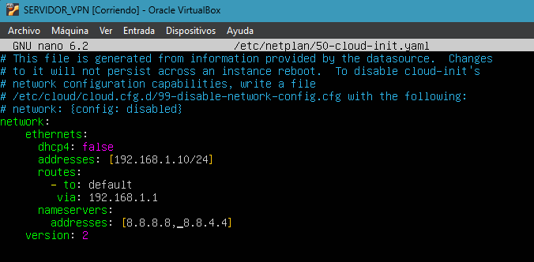

**Validación de conectividad:**

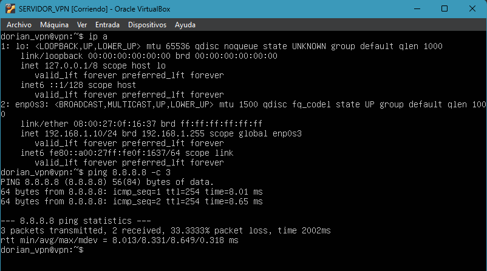

---

## 4. Instalación y Configuración del Proxy (Squid)

El servicio Squid permite intermediar las peticiones web de los clientes internos.

### 4.1. Instalación y Actualización
Actualización de los repositorios e instalación de `squid`.

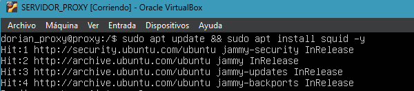

### 4.2. Definición de Políticas (ACLs)
Creación de la lista negra (`/etc/squid/blacklist.txt`) incluyendo dominios prohibidos como redes sociales y plataformas de video (`facebook.com`, `youtube.com`, `twitter.com`).

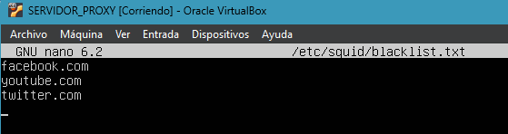

Edición del archivo principal `/etc/squid/squid.conf` estableciendo las siguientes reglas:
1.  **Puerto de escucha:** `3128`.
2.  **Orígenes permitidos:** Red LAN (`192.168.0.0/24`) y Red VPN (`192.168.1.0/24`).
3.  **Restricción Horaria:** ACL `working_hours` (Lunes a Viernes, 08:00 - 18:00).
4.  **Reglas de Acceso:**
    * Se deniega el acceso a dominios de la lista negra.
    * Se deniega el acceso a YouTube fuera del horario laboral.
    * Se permite el acceso a la red local y VPN.
    * Se deniega todo lo demás por defecto.

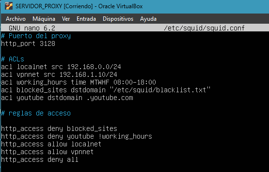

---

## 5. Configuración del Cliente Interno

En el equipo cliente (Windows 10 Pro), configuro el proxy manual en las opciones de "Red e Internet" para que todo el tráfico web pase por el Proxy.

* **Dirección:** `192.168.0.10`
* **Puerto:** `3128`

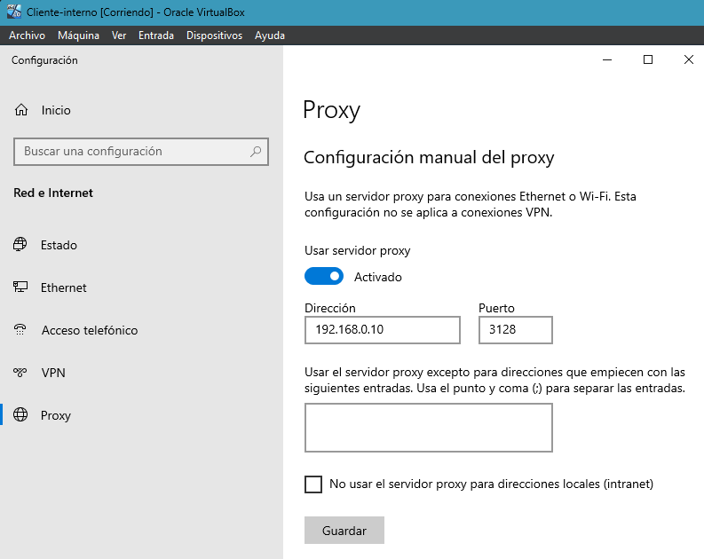

---

## 6. Instalación y Configuración de VPN (OpenVPN)

Se implementó OpenVPN en modo **Clave Estática (Static Key)** para establecer un túnel seguro punto a punto de manera simplificada .

### 6.1. Instalación y Generación de Claves
Instalación de los paquetes `openvpn` y `easy-rsa`. Posteriormente, generé la clave compartida.

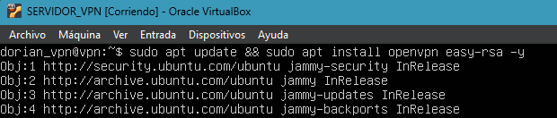

```bash
openvpn --genkey --secret /etc/openvpn/static.key
```
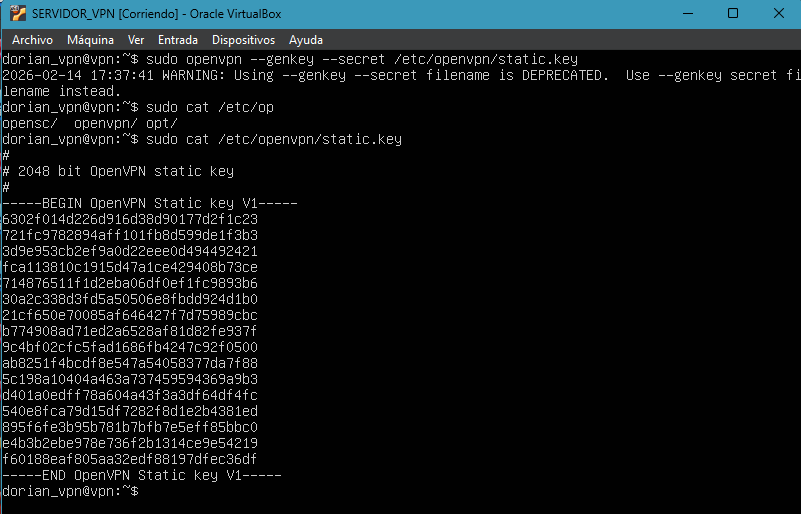


## 6.2. Habilitación del Enrutamiento (IP Forwarding)

Para que el servidor VPN funcione como un router y permita el paso de tráfico desde los
clientes VPN hacia la red interna o Internet, he habilitado el reenvío de paquetes.

Edito el archivo `/etc/sysctl.conf` descomentando la línea:
```ini
net.ipv4.ip_forward=1
```
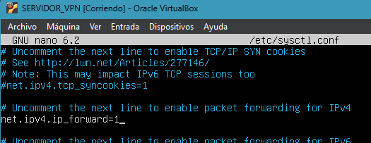

Posteriormente aplico los cambios con el comando:

```bash
sudo sysctl -p
```

## 6.3. Configuración del Servidor

Creación del archivo `/etc/openvpn/server.conf` definiendo la topología del túnel:

- **Dispositivo de túnel:** `dev tun`
- **Direccionamiento virtual:** `10.8.0.1` (Servidor) - `10.8.0.2` (Punto remoto)
- **Ruta empujada (`push route`):** Se anuncia la red interna `192.168.0.0/24` a los clientes
  conectados para que sepan cómo llegar a la LAN.

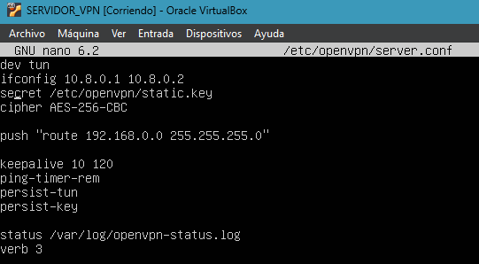

## 6.4. Estado del Servicio

Inicio del servicio `openvpn@server` y verificación de que la interfaz `tun0` se ha levantado
correctamente y el servicio está funcionando.

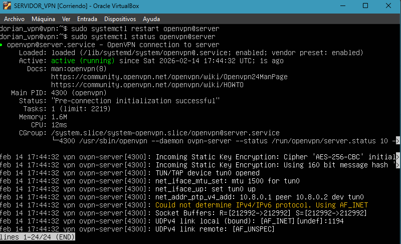

---

## 7. Pruebas de Conectividad (Proxy)

En esta sección se valida el correcto funcionamiento del servidor Proxy, asegurando que permite
el tráfico legítimo y bloquea el no autorizado según las políticas definidas.

### a) Verifica conectividad desde el cliente interno (192.168.0.100)

**Prueba de navegación:**
Accedo desde el navegador del cliente a un sitio web permitido, en este caso
`https://www.google.com`.

**Logs del Proxy:**
Simultáneamente, en el servidor Proxy, verifiqué los logs de acceso en tiempo real
mediante el comando:
```bash
sudo tail -f /var/log/squid/access.log
```
**Resultado obtenido:** Los registros muestran la solicitud del cliente (`192.168.0.100`)
con el estado `TCP_TUNNEL` (conexión establecida).

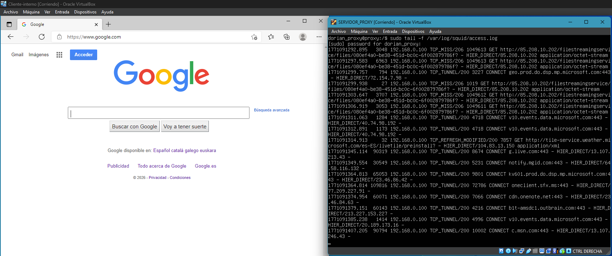

---

### b) Bloqueo de sitios configurados en Squid

**Prueba de bloqueo:**
Intento acceder a un sitio configurado en la lista negra (`blacklist.txt`), por ejemplo
`https://www.twitter.com` o `https://www.youtube.com`.

**Verificación de logs:**
Busco las entradas correspondientes al bloqueo en el servidor:
```bash
sudo tail -f /var/log/squid/access.log
```
**Resultado obtenido:** El log registra el intento de acceso con el código de error
`TCP_DENIED/403`, confirmando que la ACL de bloqueo está funcionando.

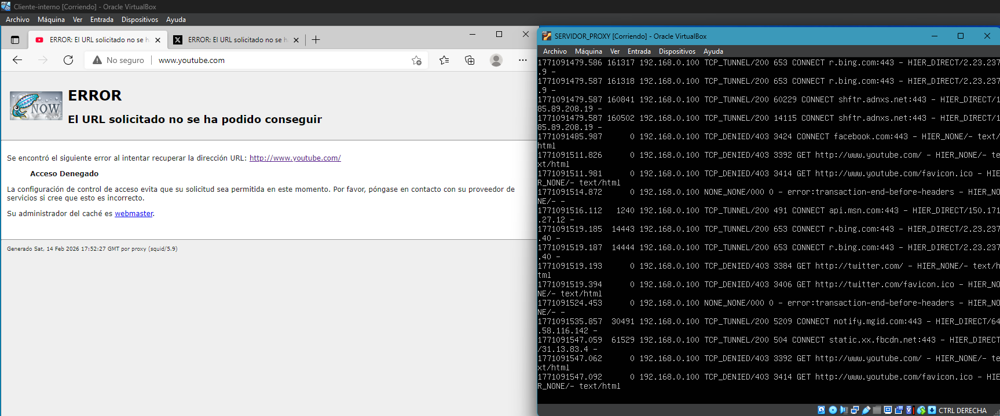

---

### c) Restricciones de tiempo

**Prueba de horario:**
Intento acceder a YouTube fuera del horario
permitido configurado en las ACLs (fuera del rango `08:00-18:00`).

**Verificación de logs:**
Al revisar los registros durante el intento fuera de hora:
```bash
sudo tail -f /var/log/squid/access.log
```
**Resultado obtenido:** Observo entradas con `TCP_DENIED`, validando que la restricción temporal `working_hours` está activa.

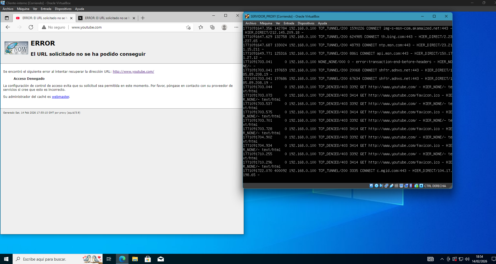

---

## 8. Pruebas de Seguridad (Aislamiento de Red)

El objetivo es validar que la segmentación de red impide el acceso no autorizado desde la
zona expuesta (DMZ) hacia la zona segura (LAN).

### a) Acceso desde la DMZ a la red interna

Desde el servidor VPN (`192.168.1.10`) ubicado en la DMZ, intento realizar conexiones
hacia el cliente interno (`192.168.0.100`) y el Proxy (`192.168.0.10`).

**Prueba de Ping (ICMP):**
Se ejecutó un ping hacia el cliente interno:
```bash
ping 192.168.0.100
```
- **Resultado obtenido:** `100%` de pérdida de paquetes (Packet Loss), confirmando el bloqueo.

**Prueba de conexión SSH:**
Conección por SSH al servidor Proxy desde la DMZ:
```bash
ssh dorian_proxy@192.168.0.10
```
- **Resultado obtenido:** La conexión expira (`Connection timed out`), lo que indica que el Firewall está descartando los paquetes al puerto `22`.

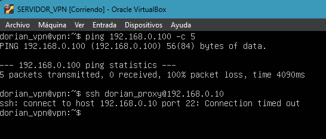

---

## 9. Verificación del Tráfico Proxy y Más Pruebas

### Verificación del tráfico Proxy

Desde el cliente interno (`192.168.0.100`) navego por internet para generar tráfico.

**Logs:**
Confirmo que todo el tráfico web pasa por Squid visualizando el flujo constante en:
```bash
sudo tail -f /var/log/squid/access.log
```
**Resultado:** Aparecen listadas todas las peticiones hacia el dominio visitado, confirmando la intercepción del Proxy.

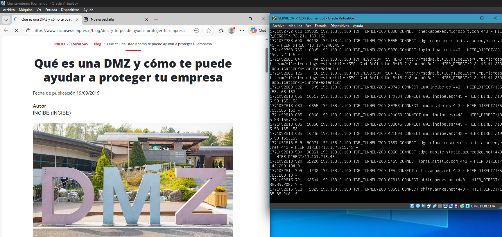

---

### Prueba DNS y Traceroute completo

Desde el cliente interno (Windows),verfico la resolución de nombre y veo con tracert la ruta de los paquetes:
```cmd
tracert -d 8.8.8.8
nslookup www.google.com
```
- **Resultado obtenido:** El servidor DNS responde correctamente con la IP del dominio, confirmando que las peticiones DNS (Puerto `53`) atraviesan correctamente los firewalls, y el tracert veo que el trafico pasa por el FW2 y FW1 correctamente.

> **Observación:** Al utilizar `tracert` (ICMP), el tráfico viaja a nivel de red (Capa 3) pasando por el Gateway (`192.168.0.1`) y luego hacia el exterior, es decir, no pasa por el Proxy lo cual es el comportamiento correcto ya que el Proxy opera en Capa 7 (Aplicación).

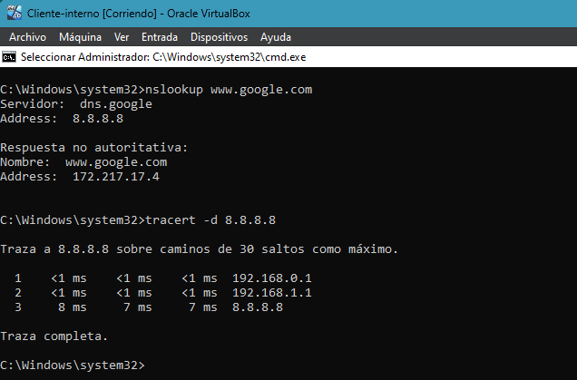

---
