## PARTE A — Inyección SQL (SQL Injection) en Python y Flask

### A1. Desarrollo de aplicación vulnerable

**CREAMOS LA APP Y EL DIRECTORIO DE EL LOGIN HTML**

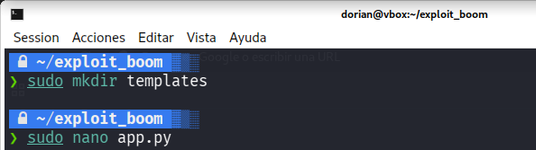
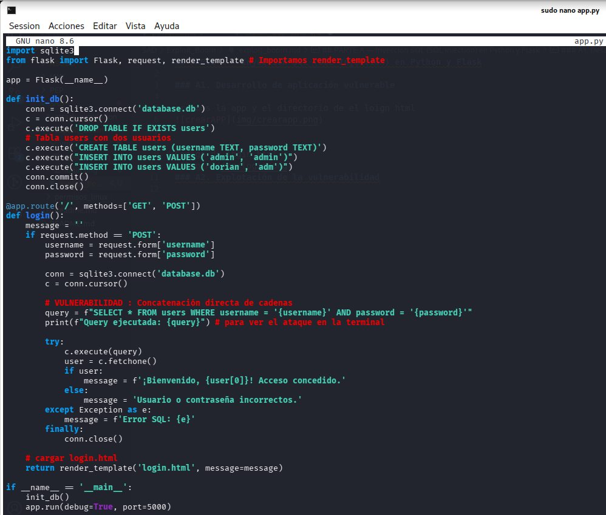

**CÓDIGO DE LA APP**

```python
import sqlite3
from flask import Flask, request, render_template # Importamos render_template

app = Flask(__name__)

def init_db():
    conn = sqlite3.connect('database.db')
    c = conn.cursor()
    c.execute('DROP TABLE IF EXISTS users')
    # Tabla users con dos usuarios
    c.execute('CREATE TABLE users (username TEXT, password TEXT)')
    c.execute("INSERT INTO users VALUES ('admin', 'admin')")
    c.execute("INSERT INTO users VALUES ('dorian', 'adm')")
    conn.commit()
    conn.close()

@app.route('/', methods=['GET', 'POST'])
def login():
    message = ''
    if request.method == 'POST':
        username = request.form['username']
        password = request.form['password']
        
        conn = sqlite3.connect('database.db')
        c = conn.cursor()
        
        # VULNERABILIDAD : Concatenación directa de cadenas
        query = f"SELECT * FROM users WHERE username = '{username}' AND password = '{password}'"
        print(f"Query ejecutada: {query}") # para ver el ataque en la terminal
        
        try:
            c.execute(query)
            user = c.fetchone()
            if user:
                message = f'¡Bienvenido, {user[0]}! Acceso concedido.'
            else:
                message = 'Usuario o contraseña incorrectos.'
        except Exception as e:
            message = f'Error SQL: {e}'
        finally:
            conn.close()
            
    # cargar login.html
    return render_template('login.html', message=message)

if __name__ == '__main__':
    init_db()
    app.run(debug=True, port=5000)

```

**CÓDIGO DE login.html**

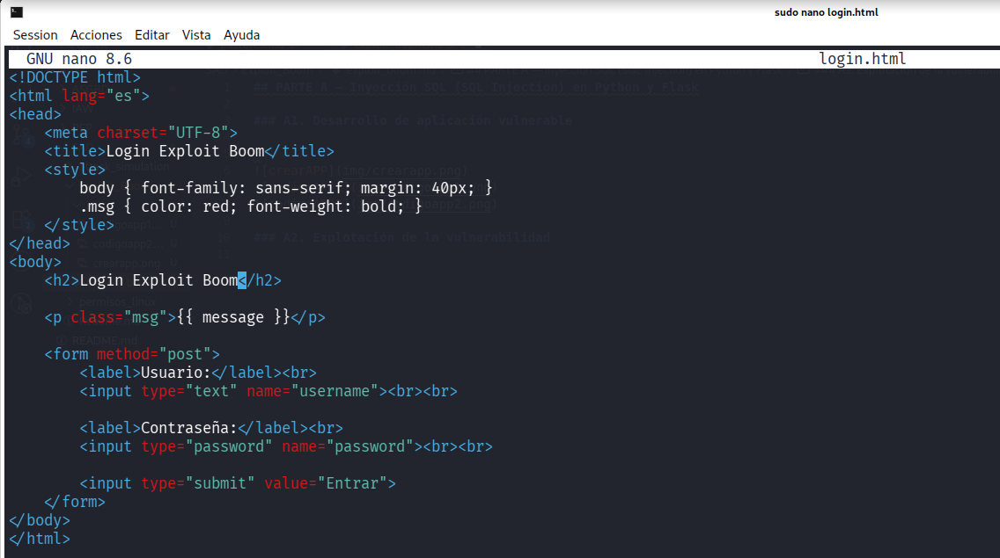

```html
<!DOCTYPE html>
<html lang="es">
<head>
    <meta charset="UTF-8">
    <title>Login Exploit Boom</title>
    <style>
        body { font-family: sans-serif; margin: 40px; }
        .msg { color: red; font-weight: bold; }
    </style>
</head>
<body>
    <h2>Login Exploit Boom</h2>
    
    <p class="msg">{{ message }}</p>

    <form method="post">
        <label>Usuario:</label><br>
        <input type="text" name="username"><br><br>
        
        <label>Contraseña:</label><br>
        <input type="password" name="password"><br><br>
        
        <input type="submit" value="Entrar">
    </form>
</body>
</html>

```

**COMPROBACIÓN DEL FUNCIONAMIENTO**

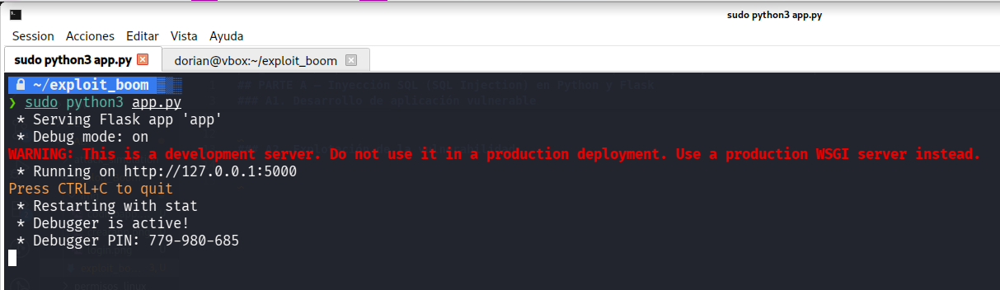
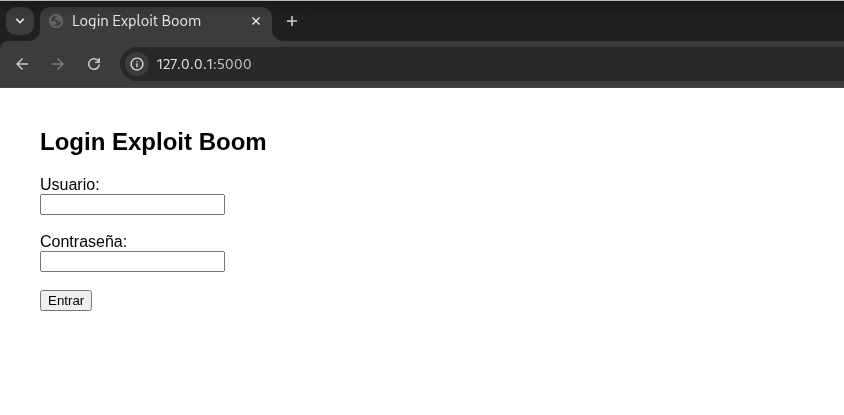

### A2. Explotación de la vulnerabilidad

**PRUEBA DE PAYLOADS** 

> **' OR 1=1 --**

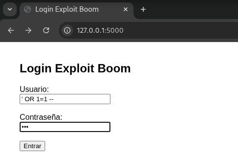
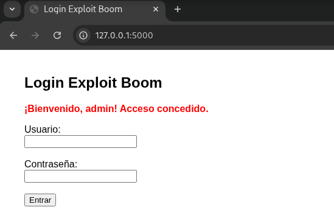
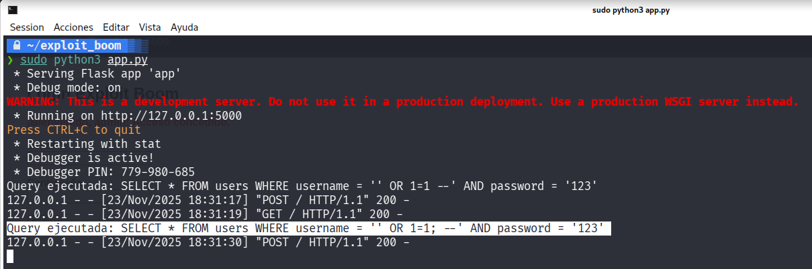

> **admin' --**

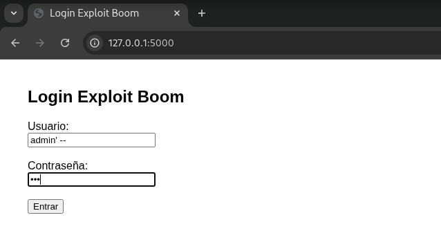
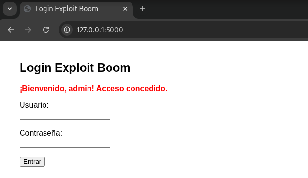
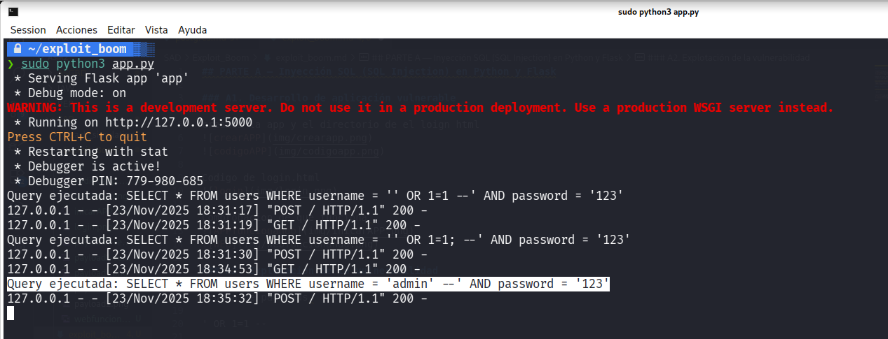

> **dorian' --**

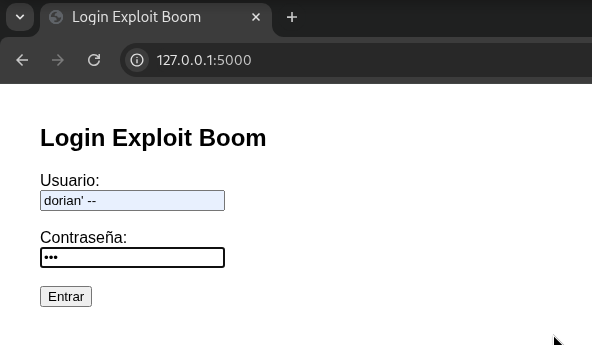
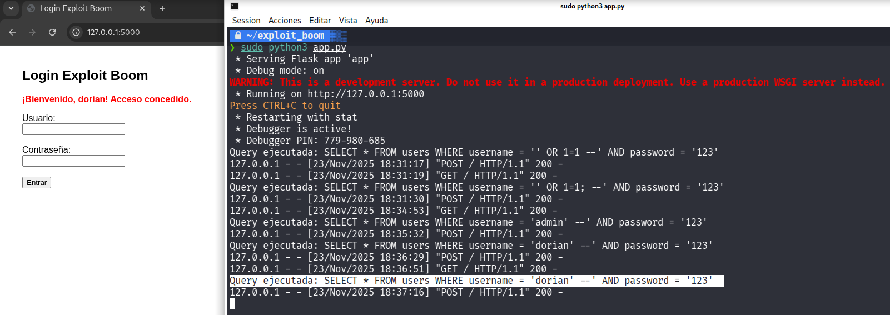

### A3. Corrección y mitigación

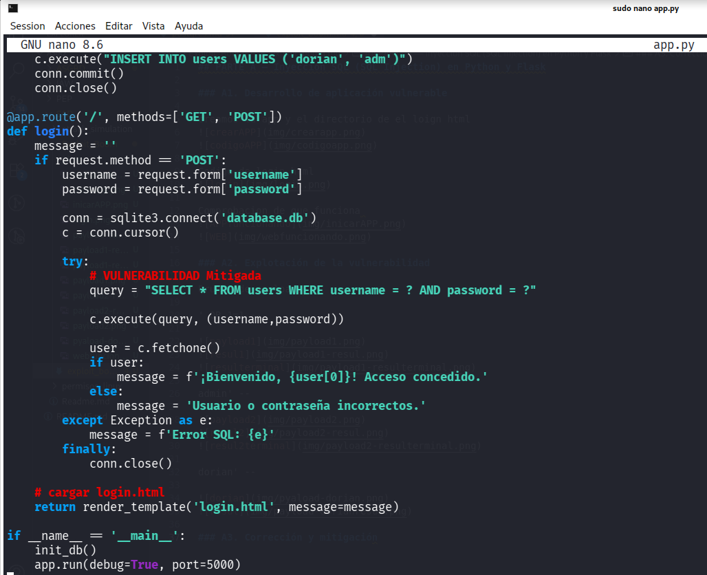

**CÓDIGO CON LA VULNERABILIDAD MITIGADA** 

```python
import sqlite3
from flask import Flask, request, render_template # Importamos render_template

app = Flask(__name__)

def init_db():
    conn = sqlite3.connect('database.db')
    c = conn.cursor()
    c.execute('DROP TABLE IF EXISTS users')
    # Tabla users con dos usuarios
    c.execute('CREATE TABLE users (username TEXT, password TEXT)')
    c.execute("INSERT INTO users VALUES ('admin', 'admin')")
    c.execute("INSERT INTO users VALUES ('dorian', 'adm')")
    conn.commit()
    conn.close()

@app.route('/', methods=['GET', 'POST'])
def login():
    message = ''
    if request.method == 'POST':
        username = request.form['username']
        password = request.form['password']

        conn = sqlite3.connect('database.db')
        c = conn.cursor()

        try:
            # VULNERABILIDAD Mitigada
            query = "SELECT * FROM users WHERE username = ? AND password = ?"

            c.execute(query, (username,password))

            user = c.fetchone()
            if user:
                message = f'¡Bienvenido, {user[0]}! Acceso concedido.'
            else:
                message = 'Usuario o contraseña incorrectos.'
        except Exception as e:
            message = f'Error SQL: {e}'
        finally:
            conn.close()

    # cargar login.html
    return render_template('login.html', message=message)

if __name__ == '__main__':
    init_db()
    app.run(debug=True, port=5000)

```

**COMPROBACIÓN**

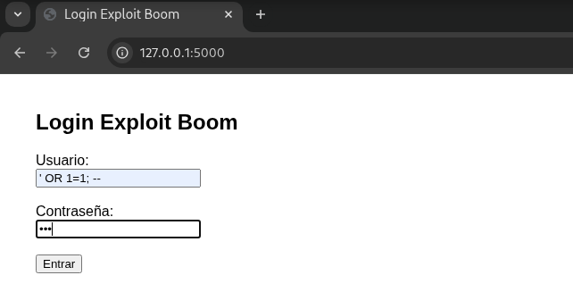
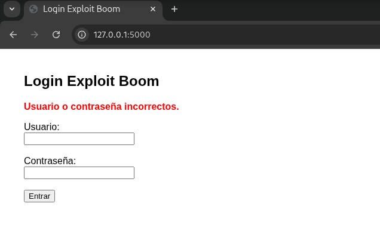


## PARTE B — XSS Reflejado en PHP

### B1. Desarrollo de aplicación vulnerable

**CREACIÓN DEL ARCHIVO search.php**

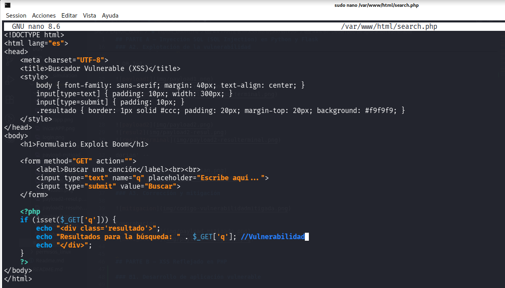

**CÓDIGO VULNERABLE**

```html
<!DOCTYPE html>
<html lang="es">
<head>
    <meta charset="UTF-8">
    <title>Buscador Vulnerable (XSS)</title>
    <style>
        body { font-family: sans-serif; margin: 40px; text-align: center; }
        input[type=text] { padding: 10px; width: 300px; }
        input[type=submit] { padding: 10px; }
        .resultado { border: 1px solid #ccc; padding: 20px; margin-top: 20px; background: #f9f9f9; }
    </style>
</head>
<body>
    <h1>Formulario Exploit Boom</h1>

    <form method="GET" action="">
        <label>Buscar una canción</label><br><br>
        <input type="text" name="q" placeholder="Escribe aquí...">
        <input type="submit" value="Buscar">
    </form>

    <?php
    if (isset($_GET['q'])) {
        echo "<div class='resultado'>";
        echo "Resultados para la búsqueda: " . $_GET['q']; //Vulnerabilidad       
        echo "</div>";
    }
    ?>
</body>
</html>

```

**INICIAMOS APACHE Y EL ARCHIVO EN LOCALHOST**

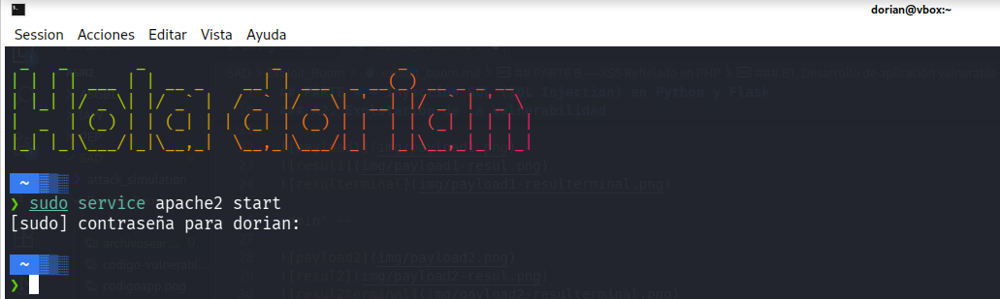
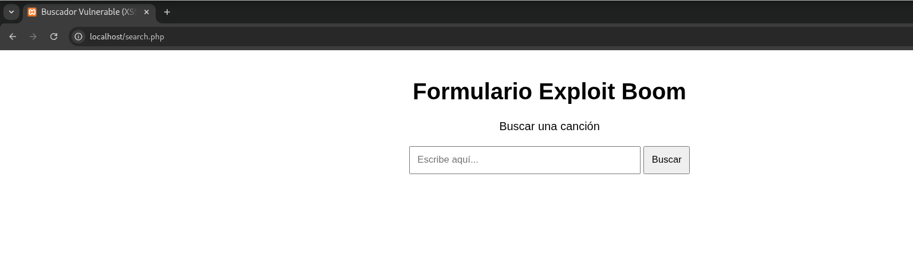

**EJECUCIÓN DEL ATAQUE**

> **forma 1: desde la url** 

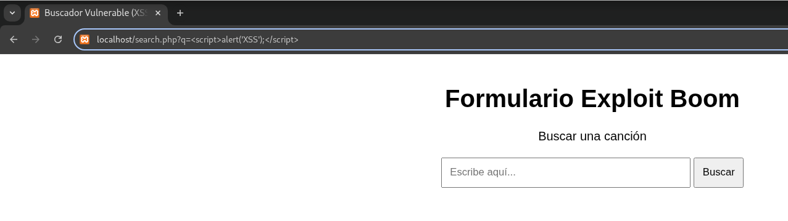
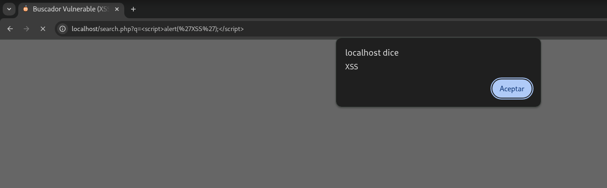

> **forma 2: desde el form**

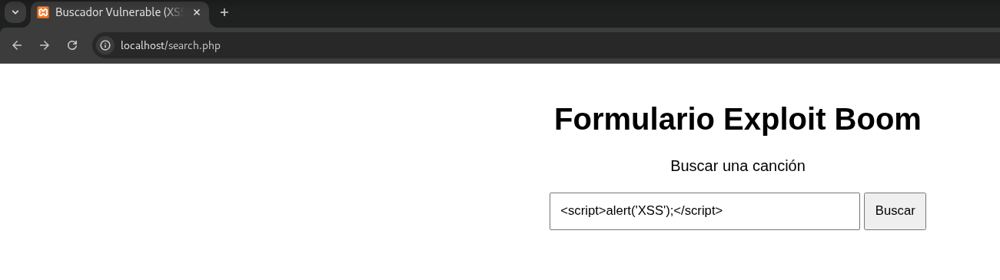
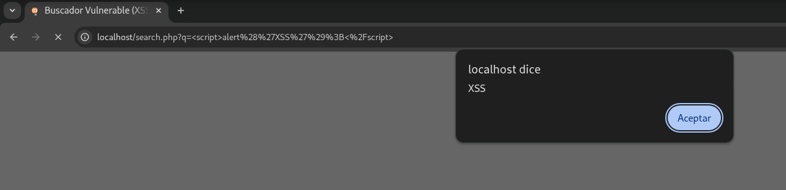

### B2. Corrección de la vulnerabilidad

**CORRECCIÓN CON LA FUNCIÓN htmlspecialchars()** 

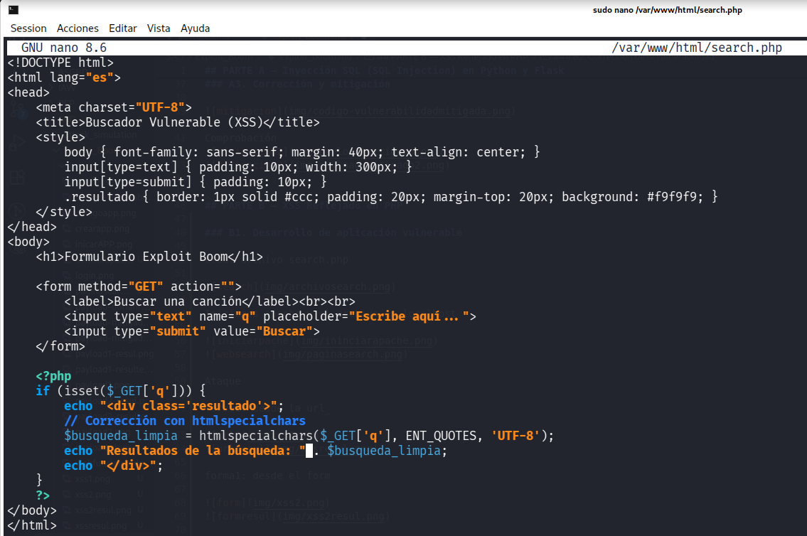

**CÓDIGO CORREGIDO**

```html
<!DOCTYPE html>
<html lang="es">
<head>
    <meta charset="UTF-8">
    <title>Buscador Vulnerable (XSS)</title>
    <style>
        body { font-family: sans-serif; margin: 40px; text-align: center; }
        input[type=text] { padding: 10px; width: 300px; }
        input[type=submit] { padding: 10px; }
        .resultado { border: 1px solid #ccc; padding: 20px; margin-top: 20px; background: #f9f9f9; }
    </style>
</head>
<body>
    <h1>Formulario Exploit Boom</h1>

    <form method="GET" action="">
        <label>Buscar una canción</label><br><br>
        <input type="text" name="q" placeholder="Escribe aquí...">
        <input type="submit" value="Buscar">
    </form>

    <?php
    if (isset($_GET['q'])) {
        echo "<div class='resultado'>";
        // Corrección con htmlspecialchars
        $busqueda_limpia = htmlspecialchars($_GET['q'], ENT_QUOTES, 'UTF-8');
        echo "Resultados de la búsqueda: " . $busqueda_limpia;
        echo "</div>";
    }
    ?>
</body>
</html>
```

**COMPROBACIÓN** 

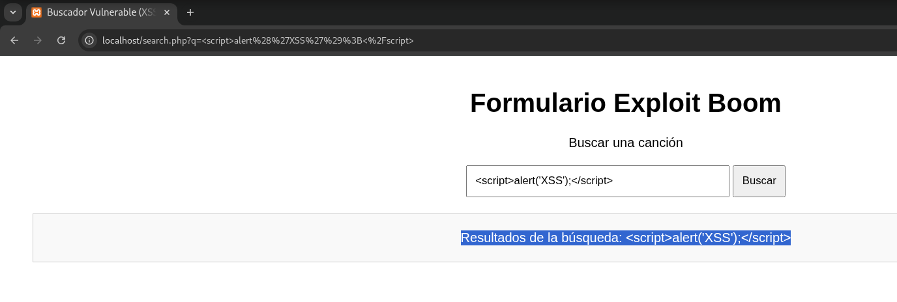

## PARTE C — Implementación de XSS persistente en Flask

**MODIFICACIONES EN EL ARCHIVO DE app.py**

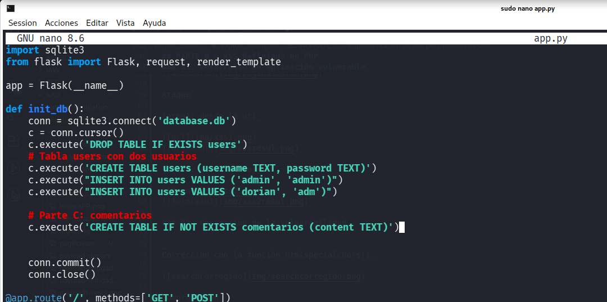
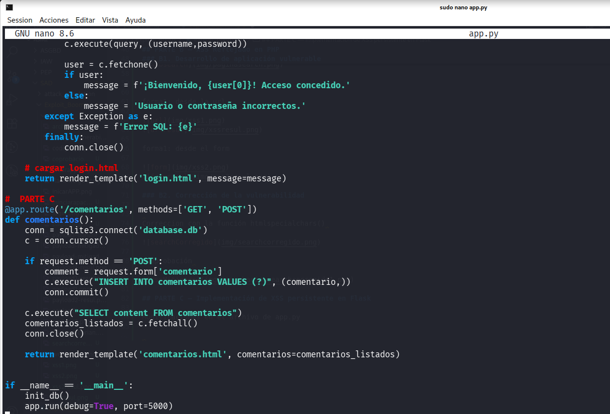

**CÓDIGO**

```python

import sqlite3
from flask import Flask, request, render_template

app = Flask(__name__)

def init_db():
    conn = sqlite3.connect('database.db')
    c = conn.cursor()
    c.execute('DROP TABLE IF EXISTS users')
    # Tabla users con dos usuarios
    c.execute('CREATE TABLE users (username TEXT, password TEXT)')
    c.execute("INSERT INTO users VALUES ('admin', 'admin')")
    c.execute("INSERT INTO users VALUES ('dorian', 'adm')")

    # Parte C: comentarios
    c.execute('CREATE TABLE IF NOT EXISTS comentarios (content TEXT)')


    conn.commit()
    conn.close()

@app.route('/', methods=['GET', 'POST'])
def login():
    message = ''
    if request.method == 'POST':
        username = request.form['username']
        password = request.form['password']

        conn = sqlite3.connect('database.db')
        c = conn.cursor()

        try:
            # VULNERABILIDAD Mitigada
            query = "SELECT * FROM users WHERE username = ? AND password = ?"

            c.execute(query, (username,password))

            user = c.fetchone()
            if user:
                message = f'¡Bienvenido, {user[0]}! Acceso concedido.'
            else:
                message = 'Usuario o contraseña incorrectos.'
        except Exception as e:
            message = f'Error SQL: {e}'
        finally:
            conn.close()

    # cargar login.html
    return render_template('login.html', message=message)

#  PARTE C
@app.route('/comentarios', methods=['GET', 'POST'])
def comentarios():
    conn = sqlite3.connect('database.db')
    c = conn.cursor()

    if request.method == 'POST':
        comentario = request.form['comentario']
        c.execute("INSERT INTO comentarios VALUES (?)", (comentario,))
        conn.commit()

    c.execute("SELECT content FROM comentarios")
    comentarios_listados = c.fetchall()
    conn.close()

    return render_template('comentarios.html', comentarios=comentarios_listados)


if __name__ == '__main__':
    init_db()
    app.run(debug=True, port=5000)

```

**CREACIÓN DE comentarios.html**

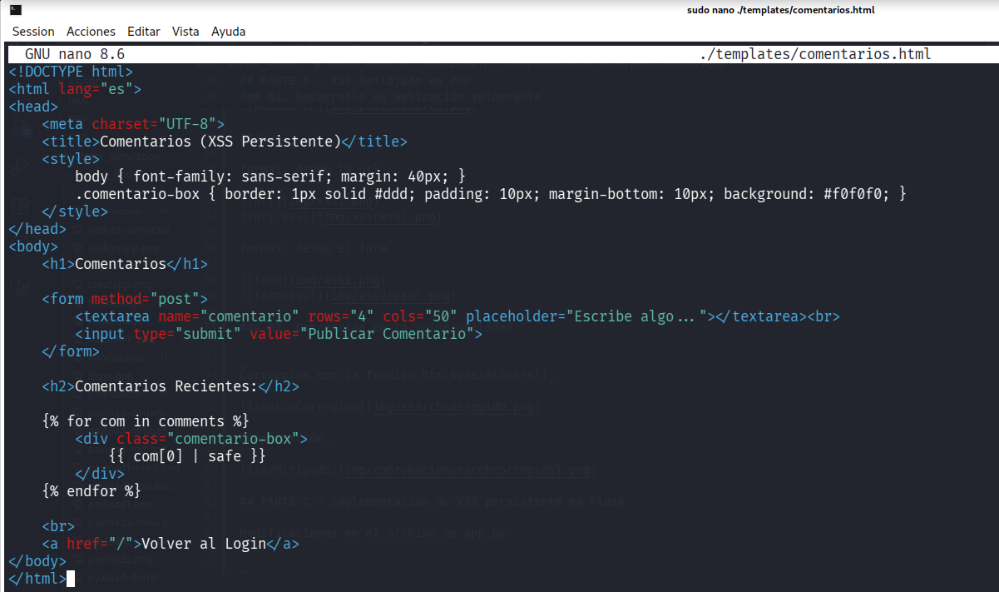

**CÓDIGO**

```html
<!DOCTYPE html>
<html lang="es">
<head>
    <meta charset="UTF-8">
    <title>Comentarios (XSS Persistente)</title>
    <style>
        body { font-family: sans-serif; margin: 40px; }
        .comentario-box { border: 1px solid #ddd; padding: 10px; margin-bottom: 10px; background: #f0f0f0; }
    </style>
</head>
<body>
    <h1>Comentarios</h1>
    
    <form method="post">
        <textarea name="comentario" rows="4" cols="50" placeholder="Escribe algo..."></textarea><br>
        <input type="submit" value="Publicar Comentario">
    </form>

    <h2>Comentarios Recientes:</h2>
    
    
        <div class="comentario-box">
            <!-- {{ com[0] | safe }} Codigo vulnerable ( | safe ) -->
            {{ com[0] }}
        </div>
    
    
    <br>
    <a href="/">Volver al Login</a>
</body>
</html>
```

**INICIAR LA WEB**

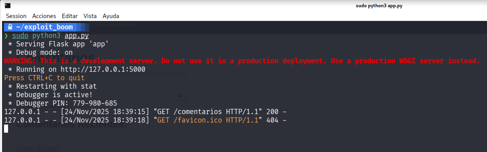
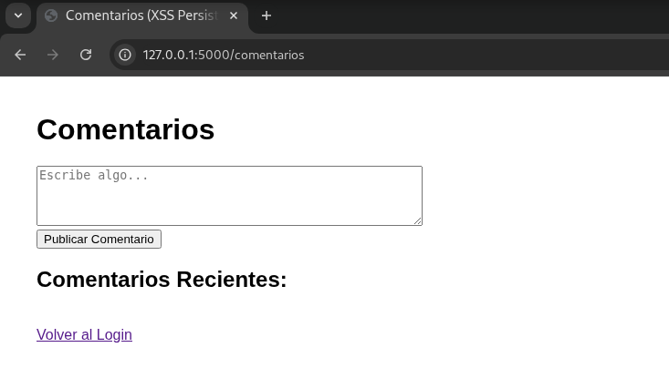

**REALIZACIÓN DEL ATAQUE**

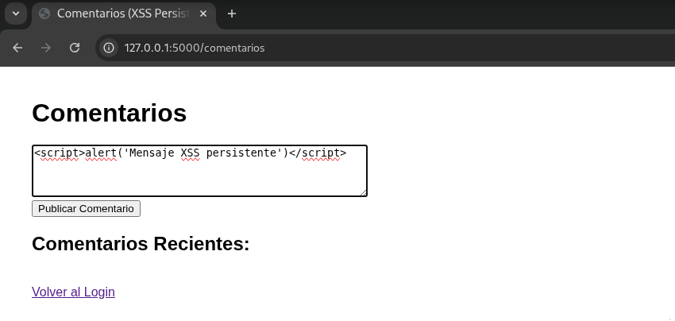
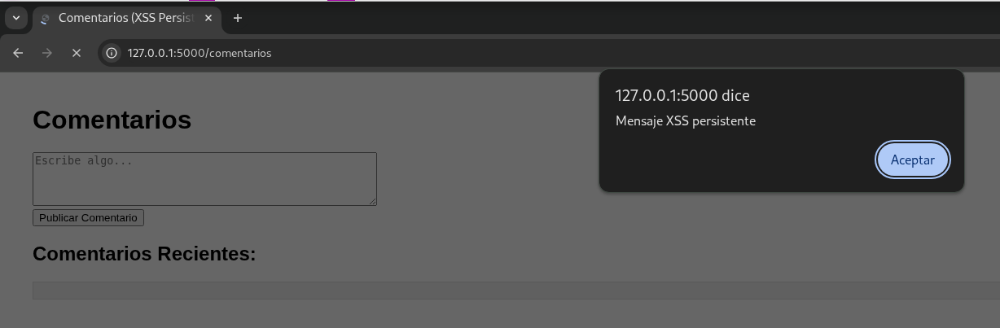

**COMPROBACIÓN DE LA BASE DE DATOS**

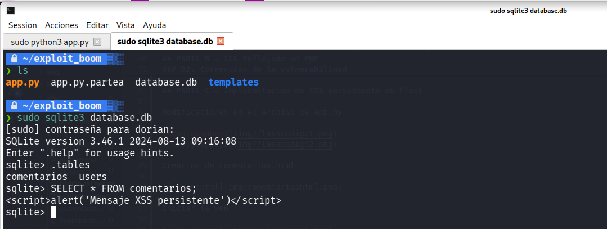

**CORRECCIÓN DE LA VULNERABILIDAD**

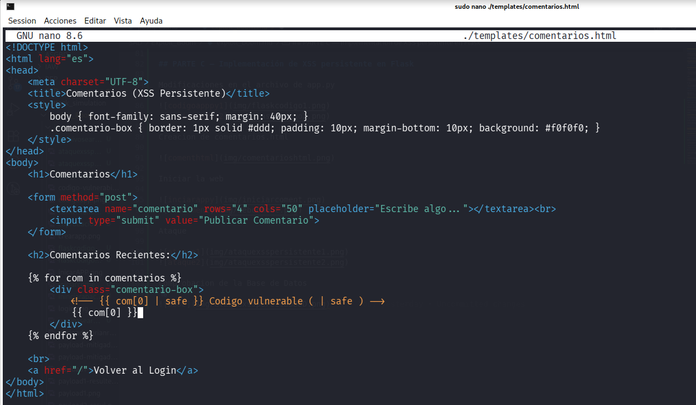

**COMPROBACIÓN DE LA VULNERABILIDAD MITIGADA** 

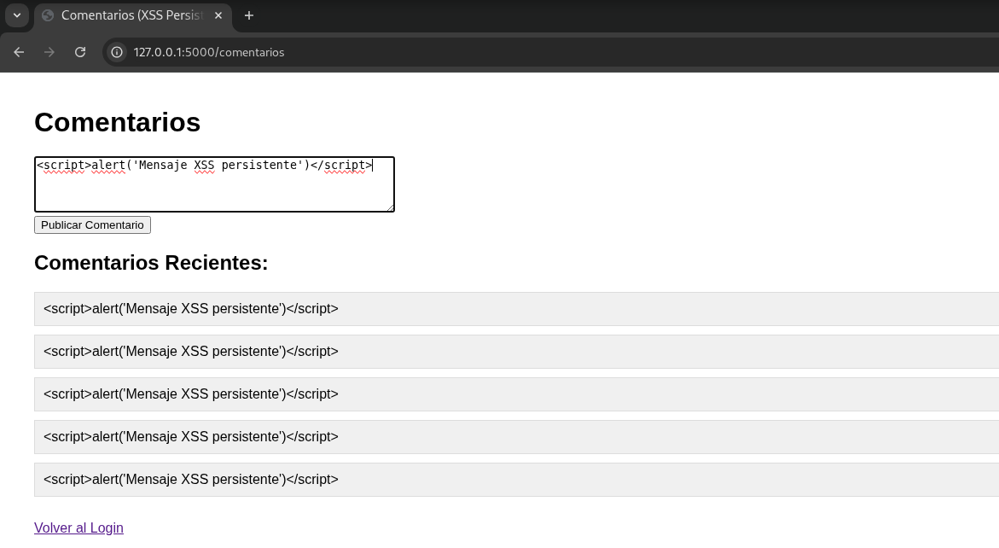