# **PERMISOS LINUX** 

## **EJERCICIO 1**

### PASO 1: Crear un entorno simulado de grupos y usuarios

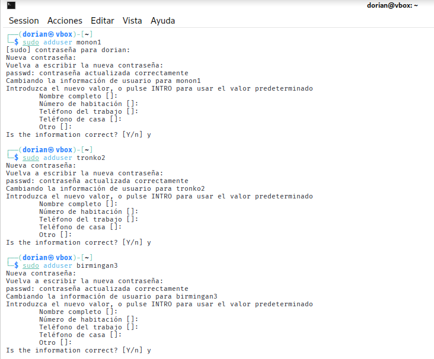
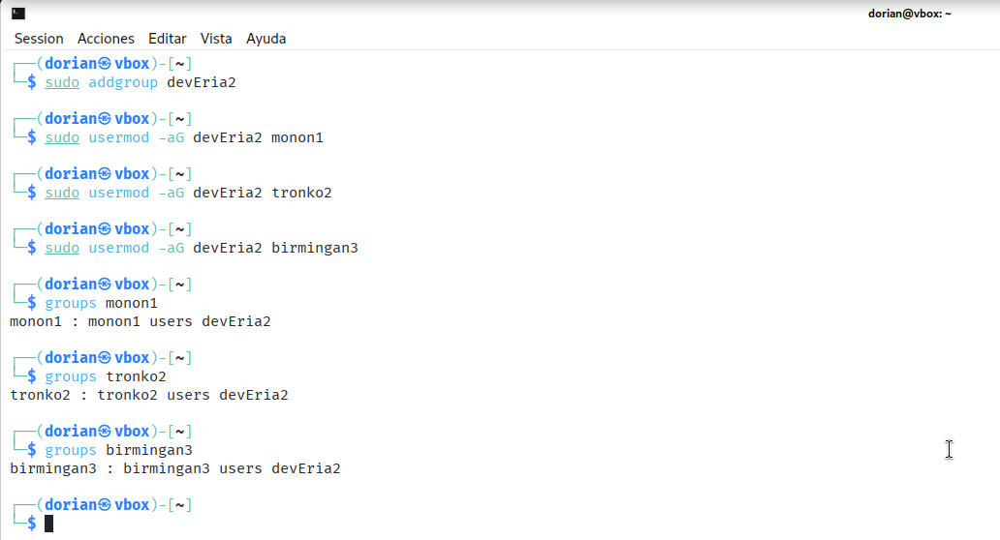
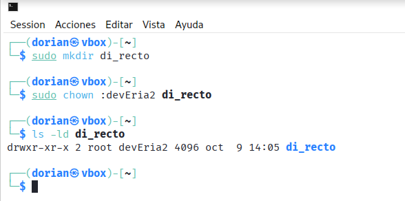

### PASO 2: Configuración de permisos básicos

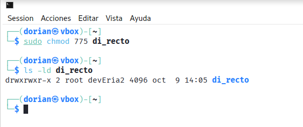

### PASO 3: Configuración de permisos avanzados 

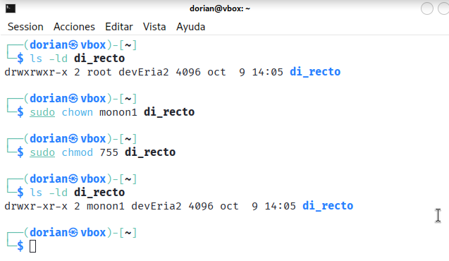

### PREGUNTAS

#### ¿Qué sucede si un usuario fuera del grupo deveria2 intenta acceder al directorio? 

Si un usario que no pertenece al grupo de devEria2 quiere acceder al directorio solo podria entrar y leer el cotenido de este pero no alterarlo, en este caso el ejercicio no especificaba los permisos de otros asi que también se podría denegar el acceso de otros grupos ajenos para mayor privacidad.

#### ¿Qué sucede si tronko2 intenta modificar un archivo dentro del directorio? 

No podría ya que solo tiene permisos de lectura y ejecución.

## **EJERCICIO 2**

### PASO 1: Crear un subdirectorio para colaboración

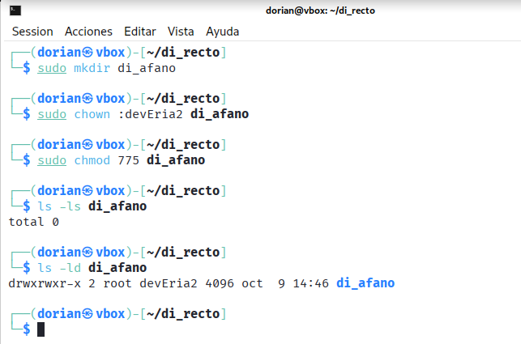

### PASO 2: Aplicar el bit SGID 

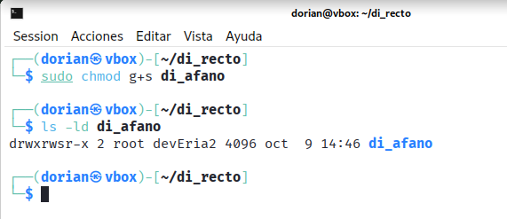

### PASO 3: Crear archivo de prueba

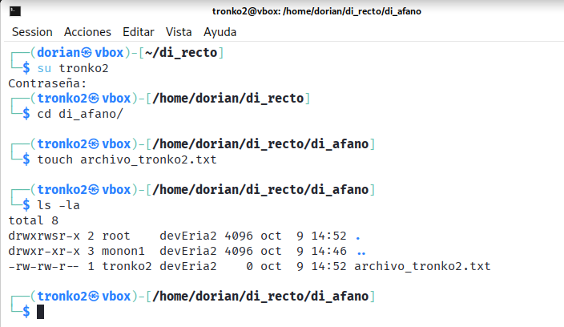

### PREGUNTAS

#### ¿Cuál es el grupo propietario del archivo creado por tronko2? 

El grupo propietario del archivo es devEria2

#### ¿Qué ventaja aporta el bit SGID en un entorno de colaboración? 

Facilita la colaboración ya que todos los archivos nuevos en un directorio compartido pertenezcan automáticamente al grupo del proyecto.

## **EJERCICIO 3**

### PASO 1: Crear un directorio temporal

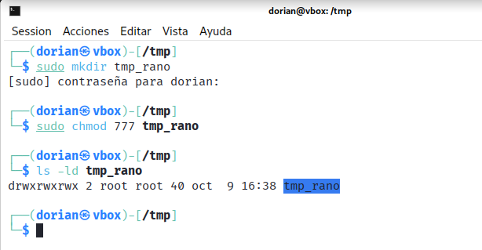

### PASO 2: Aplicar el sticky bit

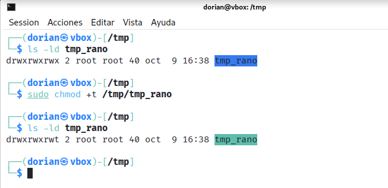

### PASO 3: Crear archivos de prueba 

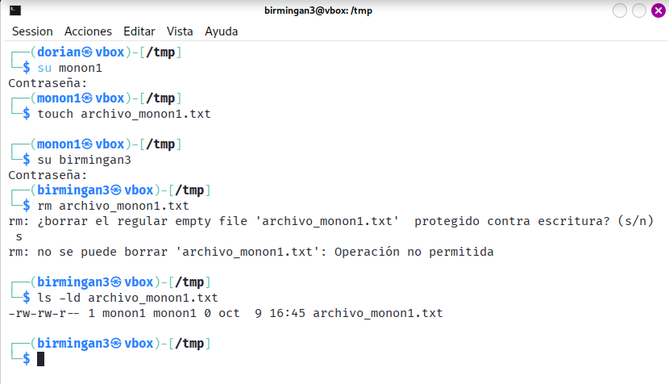

### PREGUNTAS

#### ¿Pudo birmingan3 eliminar el archivo de monon1? ¿Por qué?

No, porque no tiene permisos para modificar el archivo solo los tiene su propietario que es monon1 debido al sticky bit.

#### ¿Cómo ayuda el sticky bit a mejorar la seguridad en directorios compartidos? 

Permite que varios usuarios puedan crear archivos para algún proyecto pero mantiene la integridad de los mismos impidiendo que los usuarios manipulen los archivos de otros.

## **EJERCICIO 4**

### PASO 1: Configurar umask

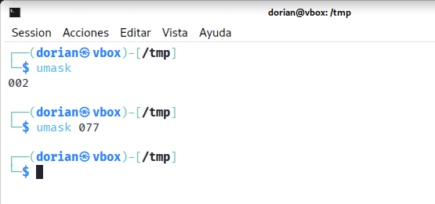

### PASO 2: Crear archivos de prueba 

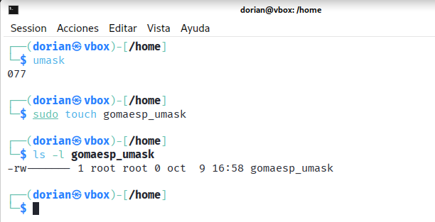

### PASO 3: Restablecer umask

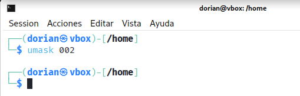

### PREGUNTAS

#### ¿Cómo afectó el valor de umask a los permisos de los nuevos archivos?

Hizo que el archivo gomaesp_umask se creara con permisos de solo lectura y escritura para el propietario y sin ningún permiso para el grupo ni para otros usuarios.

#### ¿Cómo podrías usar umask para mejorar la seguridad de los archivos en un sistema multiusuario?

Estableciendo una umask restrictiva en los perfiles de los usuarios, asegurando que los archivos que creen no sean accesibles o modificables por otros por defecto, aplicando el principio de mínimo privilegio.

## **EJERCICIO 5**

### Creación del directorio con el archivo para Birmingan3

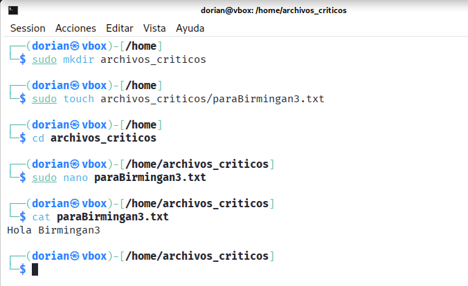

### Habilitación ACLs

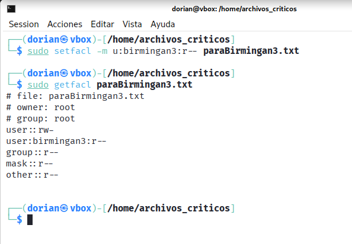

### Comprobación 

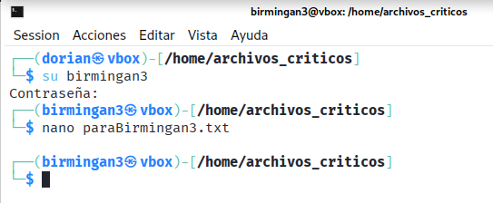
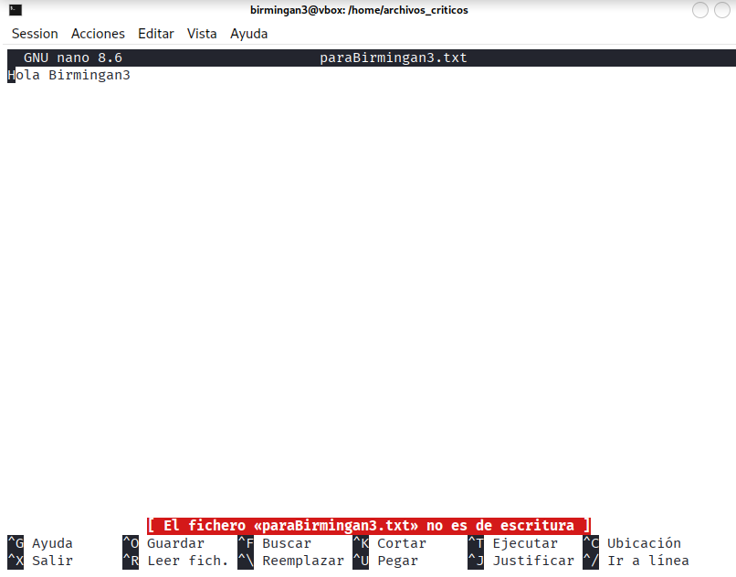

## FASE 2: Reto de Búsquedas Avanzadas

### Setup Inicial

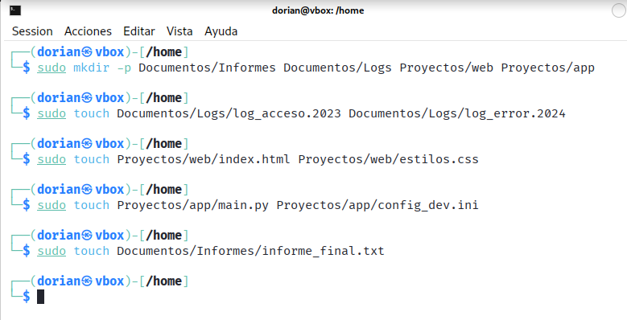

### Relleno de Contenido

#### Documentos/Logs/log_error.2024:

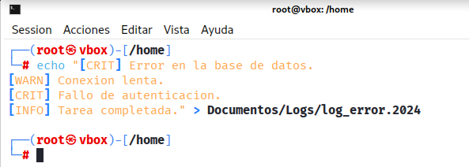

#### Proyectos/app/main.py:

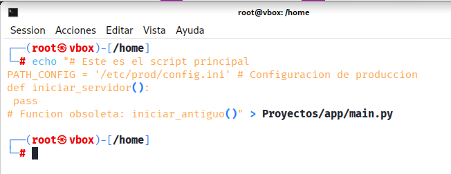

#### Proyectos/app/config_dev.ini:

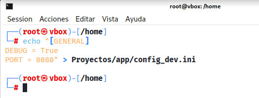

## Ejercicios de Búsqueda

### Ejercicios con grep (Búsqueda de Contenido)

#### 1. Busca Errores Críticos:

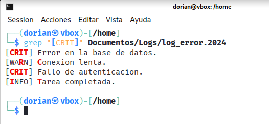

#### 2. Busca la Configuración de Producción: 

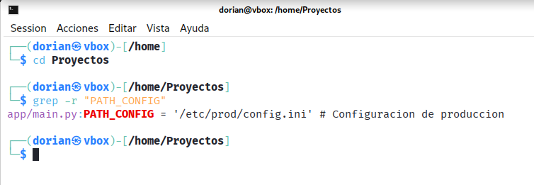

#### 3. Contar Fallos: 

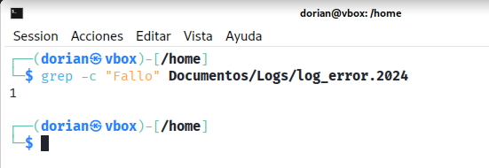

#### 4. Líneas sin Comentarios:

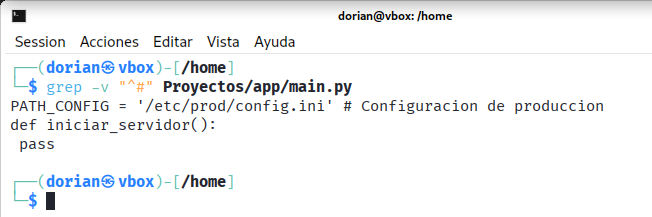

### Ejercicios con find (Búsqueda de Archivos por Propiedad)

#### 1. Archivos de Configuración:

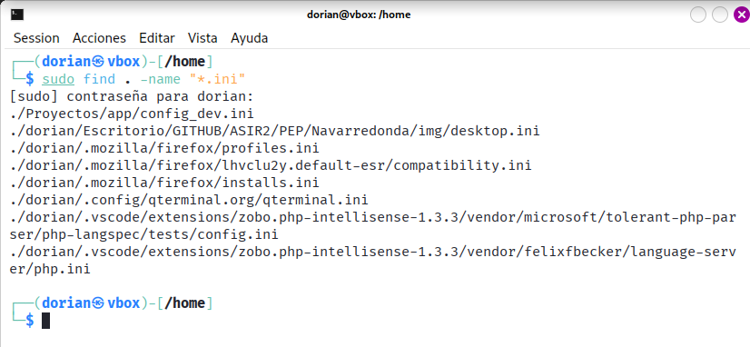

#### 2. Directorios Específicos: 

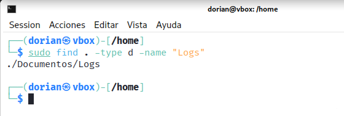

#### 3. Archivos Grandes (Simulación): 

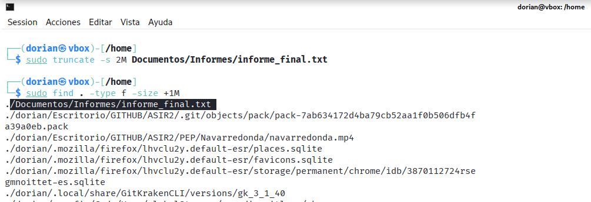

#### 4. Archivos Modificados Recientemente: 

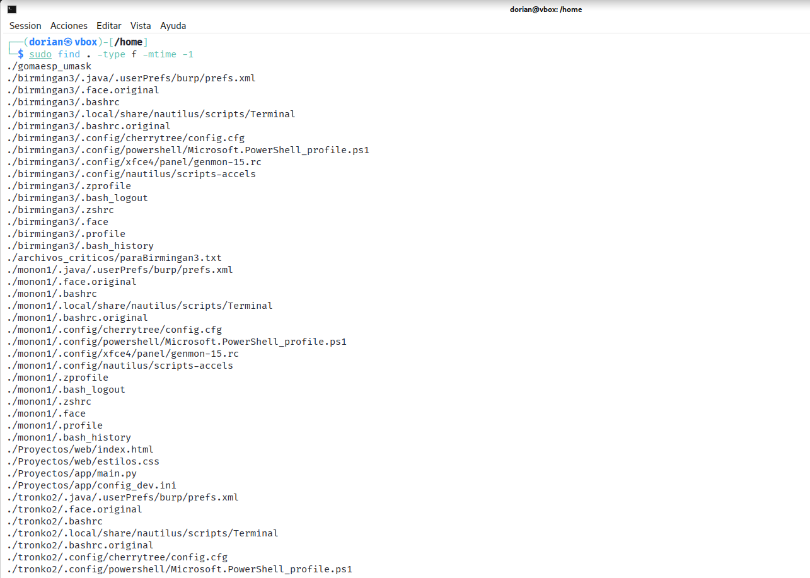

### Ejercicios con locate (Búsqueda Rápida en Base de Datos)

#### 1. Búsqueda General:

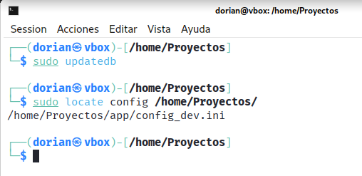

#### 2. Búsqueda Sin Distinción: 

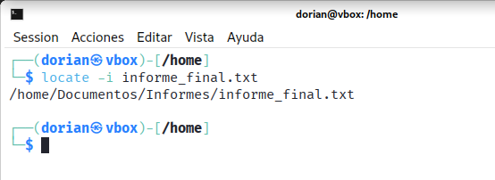