# REDIS CHALLENGE PHP

## Índice

- [REDIS CHALLENGE PHP](#redis-challenge-php)
  - [Índice](#índice)
  - [1. Instalacion de php-redis y verificaion](#1-instalacion-de-php-redis-y-verificaion)
  - [2. Comprobar la conexión de PHP con Redis](#2-comprobar-la-conexión-de-php-con-redis)
  - [3. Conexión avanzada: Gestión de datos (Hashes y Listas)](#3-conexión-avanzada-gestión-de-datos-hashes-y-listas)
  - [4. App Aceitunas](#4-app-aceitunas)
    - [4.1 Creación de la Base de Datos de Aceitunas](#41-creación-de-la-base-de-datos-de-aceitunas)
    - [4.2 Conexión con Mysql Redis y flujo de datos](#42-conexión-con-mysql-redis-y-flujo-de-datos)
    - [4.3 APP ACEITUNAS FINAL](#43-app-aceitunas-final)

___

## 1. Instalacion de php-redis y verificaion

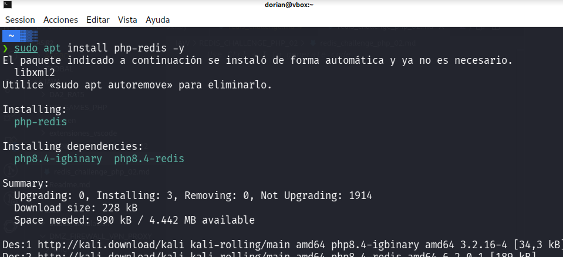

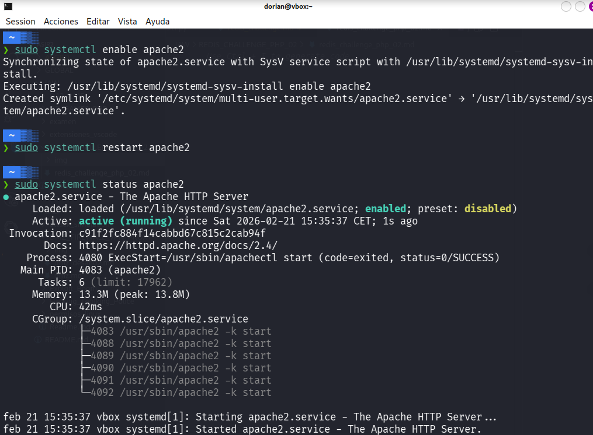

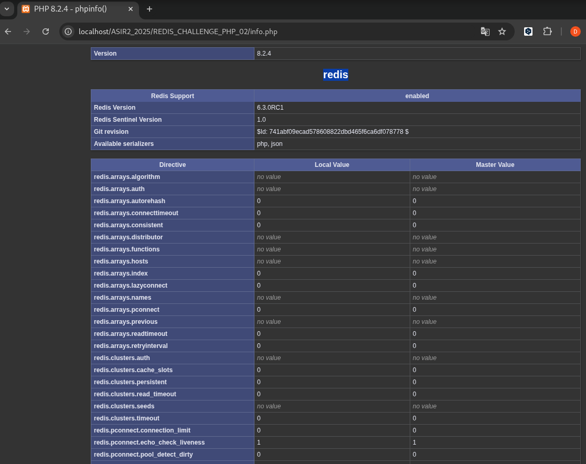

___

## 2. Comprobar la conexión de PHP con Redis


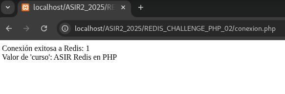

**CÓDIGO:**

```php
<?php
// Conectar a Redis
$redis = new Redis();
$redis->connect('127.0.0.1', 6379);

// Probar conexión
if ($redis->ping()) {
    echo "Conexión exitosa a Redis: " . $redis->ping() . "<br>";
}

// Establecer y obtener una clave
$redis->set("curso", "ASIR Redis en PHP");
echo "Valor de 'curso': " . $redis->get("curso") . "<br>";

// Cerrar conexión
$redis->close();
?>
```
___

## 3. Conexión avanzada: Gestión de datos (Hashes y Listas)

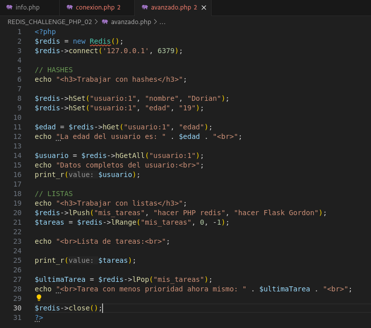

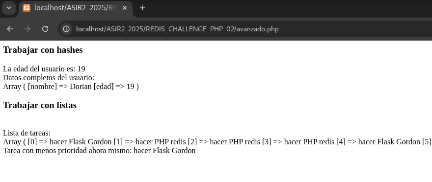

**CÓDIGO:**

```php
<?php
$redis = new Redis();
$redis->connect('127.0.0.1', 6379);

// HASHES
echo "<h3>Trabajar con hashes</h3>";

$redis->hSet("usuario:1", "nombre", "Dorian");
$redis->hSet("usuario:1", "edad", "19");

$edad = $redis->hGet("usuario:1", "edad");
echo "La edad del usuario es: " . $edad . "<br>";

$usuario = $redis->hGetAll("usuario:1");
echo "Datos completos del usuario:<br>";
print_r($usuario);

// LISTAS
echo "<h3>Trabajar con listas</h3>";
$redis->lPush("mis_tareas", "hacer PHP redis", "hacer Flask Gordon");
$tareas = $redis->lRange("mis_tareas", 0, -1);

echo "<br>Lista de tareas:<br>";

print_r($tareas);

$ultimaTarea = $redis->rPop("mis_tareas");
echo "<br>Tarea con menos prioridad ahora mismo: " . $ultimaTarea . "<br>";

$redis->close();
?>
```

___

## 4. App Aceitunas

### 4.1 Creación de la Base de Datos de Aceitunas

```sql
-- TABLA VAREADORES
CREATE TABLE vareadores (
    id INT AUTO_INCREMENT PRIMARY KEY,
    nombre VARCHAR(50) NOT NULL,
    edad INT NOT NULL
);

-- TABLA OLIVOS
CREATE TABLE olivos (
    id INT AUTO_INCREMENT PRIMARY KEY,
    ubicacion VARCHAR(60) NOT NULL,
    produccion_kg INT NOT NULL,
    finalidad VARCHAR(30) NOT NULL
);

-- TABLA VAREADORES-OLIVOS
CREATE TABLE vareador_olivo (
    vareador_id INT,
    olivo_id INT,
    PRIMARY KEY (vareador_id, olivo_id),
    FOREIGN KEY (vareador_id) REFERENCES vareadores(id) ON DELETE CASCADE,
    FOREIGN KEY (olivo_id) REFERENCES olivos(id) ON DELETE CASCADE
);

-- DATOS DE EJEMPLO
INSERT INTO vareadores (nombre, edad) VALUES ('Raul', 25), ('Juan', 38);
INSERT INTO olivos (ubicacion, produccion_kg, finalidad) VALUES ('Jaen', 60, 'Aceituna'), ('Sevilla', 92, 'Aceite');
INSERT INTO vareador_olivo (vareador_id, olivo_id) VALUES (1, 1), (1, 2), (2, 1);
```

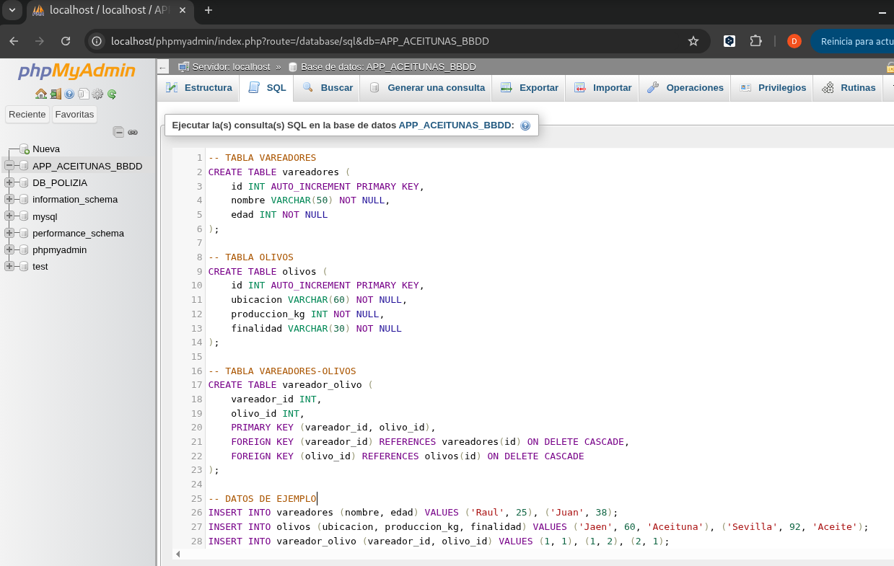

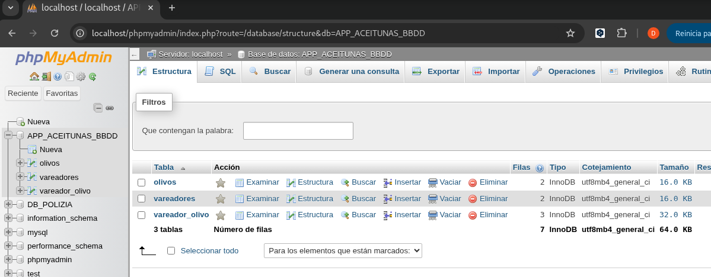

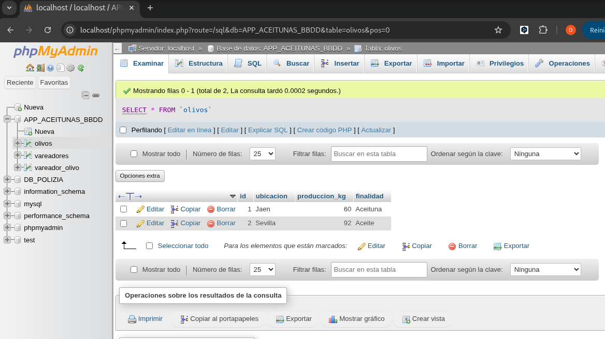

### 4.2 Conexión con Mysql Redis y flujo de datos

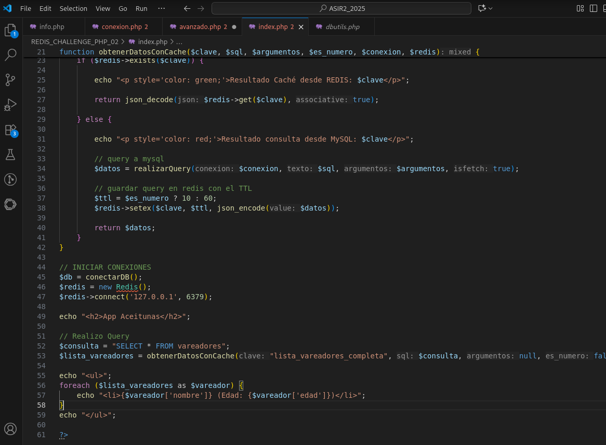

**Caché desde Mysql:**

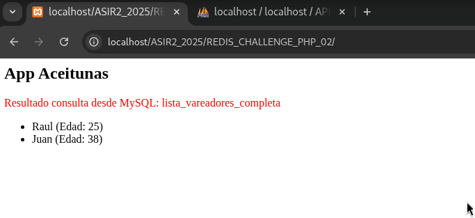

**Caché desde Redis:**

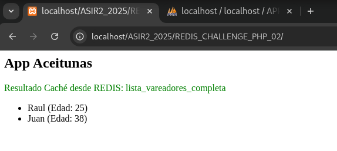

**CÓDIGO:**

```php
<?php

// CONEXIÓN A Mysql
function conectarDB() {
    try {
        $db = new PDO("mysql:host=localhost;dbname=APP_ACEITUNAS_BBDD;charset=utf8mb4", "root", "");
        $db->setAttribute(PDO::ATTR_ERRMODE, PDO::ERRMODE_EXCEPTION);
        $db->setAttribute(PDO::ATTR_DEFAULT_FETCH_MODE, PDO::FETCH_ASSOC); 
        return $db;
    } catch (PDOException $e) {
        die("Error en la Conexión: " . $e->getMessage());
    }
}
function realizarQuery($conexion, $texto, $argumentos = null, $isfetch = false) {
    $comando = $conexion->prepare($texto);
    $comando->execute($argumentos);
    if ($isfetch) return $comando->fetchAll(); 
}

// OBTENER DATOS CON CACHÉ
function obtenerDatosConCache($clave, $sql, $argumentos, $es_numero, $conexion, $redis) {

    if ($redis->exists($clave)) {
        
        echo "<p style='color: green;'>Resultado Caché desde REDIS: $clave</p>";
        
        return json_decode($redis->get($clave), true);
    
    } else {

        echo "<p style='color: red;'>Resultado consulta desde MySQL: $clave</p>";
        
        // query a mysql
        $datos = realizarQuery($conexion, $sql, $argumentos, true);

        // guardar query en redis con el TTL
        $ttl = $es_numero ? 10 : 60; 
        $redis->setex($clave, $ttl, json_encode($datos));

        return $datos;
    }
}

// INICIAR CONEXIONES
$db = conectarDB();
$redis = new Redis();
$redis->connect('127.0.0.1', 6379);

echo "<h2>App Aceitunas</h2>";

// Realizo Query
$consulta = "SELECT * FROM vareadores";
$lista_vareadores = obtenerDatosConCache("lista_vareadores_completa", $consulta, null, false, $db, $redis);

echo "<ul>";
foreach ($lista_vareadores as $vareador) {
    echo "<li>{$vareador['nombre']} (Edad: {$vareador['edad']})</li>";
}
echo "</ul>";

?>
```

### 4.3 APP ACEITUNAS FINAL 

Para no dejar tan simple la tarea he creado 4 **consultas** de **texto** y **numéricas** para ver el funcionamiento de la caché,Además he usado css para ver mejor el **flujo del sistema** mostrando de donde viene el dato (**Mysql o Redis**).

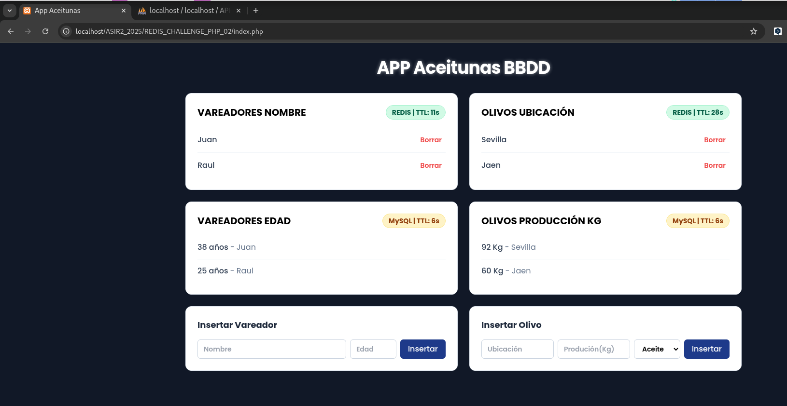

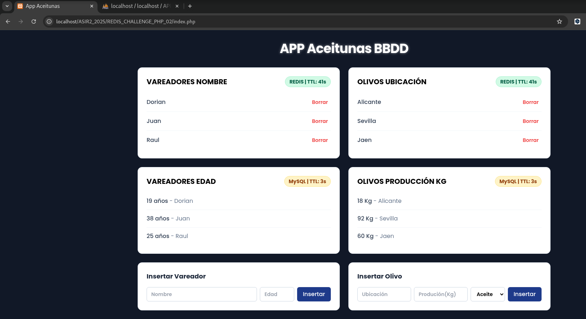

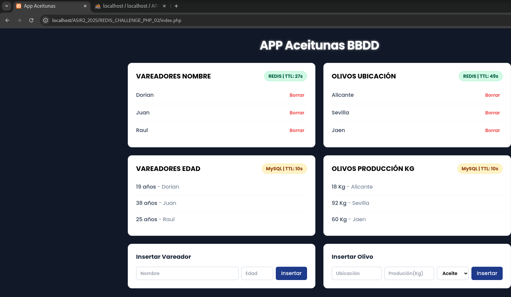


**CÓDIGO:**

[APP ACEITUNAS](./index.php)